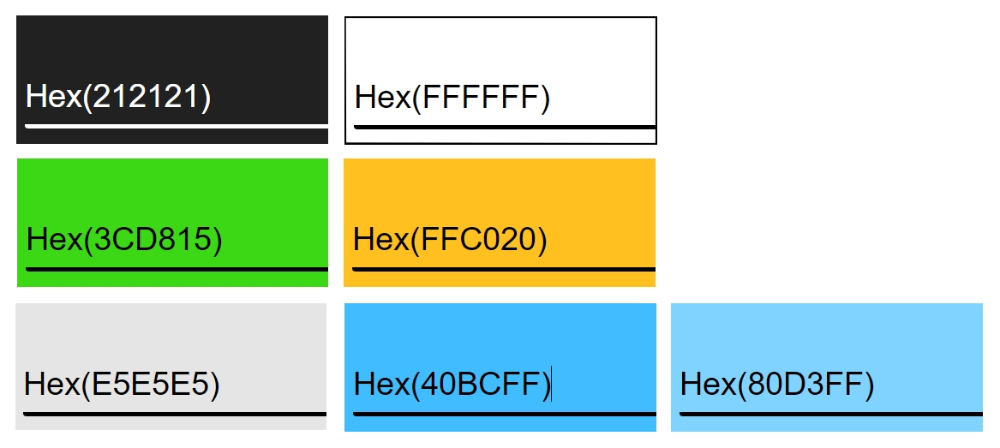

Welcome Gustaf Enebog,

This is the Code Institute student template for Gitpod. We have preinstalled all of the tools you need to get started. It's perfectly ok to use this template as the basis for your project submissions.

You can safely delete this README.md file or change it for your own project. Please do read it at least once, though! It contains some important information about Gitpod and the extensions we use. Some of this information has been updated since the video content was created. The last update to this file was: **May 28, 2024**

## Gitpod Reminders

To run a frontend (HTML, CSS, Javascript only) application in Gitpod, in the terminal, type:

`python3 -m http.server`

A blue button should appear to click: _Make Public_,

Another blue button should appear to click: _Open Browser_.

To run a backend Python file, type `python3 app.py` if your Python file is named `app.py`, of course.

A blue button should appear to click: _Make Public_,

Another blue button should appear to click: _Open Browser_.

By Default, Gitpod gives you superuser security privileges. Therefore, you do not need to use the `sudo` (superuser do) command in the bash terminal in any of the lessons.

To log into the Heroku toolbelt CLI:

1. Log in to your Heroku account and go to *Account Settings* in the menu under your avatar.
2. Scroll down to the *API Key* and click *Reveal*
3. Copy the key
4. In Gitpod, from the terminal, run `heroku_config`
5. Paste in your API key when asked

You can now use the `heroku` CLI program - try running `heroku apps` to confirm it works. This API key is unique and private to you, so do not share it. If you accidentally make it public, you can create a new one with _Regenerate API Key_.

------

## Release History

We continually tweak and adjust this template to help give you the best experience. Here is the version history:

**May 28 2024:** Fix Mongo and Links installs

**April 26 2024:** Update node version to 16

**September 20 2023:** Update Python version to 3.9.17.

**September 1 2021:** Remove `PGHOSTADDR` environment variable.

**July 19 2021:** Remove `font_fix` script now that the terminal font issue is fixed.

**July 2 2021:** Remove extensions that are not available in Open VSX.

**June 30 2021:** Combined the P4 and P5 templates into one file, added the uptime script. See the FAQ at the end of this file.

**June 10 2021:** Added: `font_fix` script and alias to fix the Terminal font issue

**May 10 2021:** Added `heroku_config` script to allow Heroku API key to be stored as an environment variable.

**April 7 2021:** Upgraded the template for VS Code instead of Theia.

**October 21 2020:** Versions of the HTMLHint, Prettier, Bootstrap4 CDN and Auto Close extensions updated. The Python extension needs to stay the same version for now.

**October 08 2020:** Additional large Gitpod files (`core.mongo*` and `core.python*`) are now hidden in the Explorer, and have been added to the `.gitignore` by default.

**September 22 2020:** Gitpod occasionally creates large `core.Microsoft` files. These are now hidden in the Explorer. A `.gitignore` file has been created to make sure these files will not be committed, along with other common files.

**April 16 2020:** The template now automatically installs MySQL instead of relying on the Gitpod MySQL image. The message about a Python linter not being installed has been dealt with, and the set-up files are now hidden in the Gitpod file explorer.

**April 13 2020:** Added the _Prettier_ code beautifier extension instead of the code formatter built-in to Gitpod.

**February 2020:** The initialisation files now _do not_ auto-delete. They will remain in your project. You can safely ignore them. They just make sure that your workspace is configured correctly each time you open it. It will also prevent the Gitpod configuration popup from appearing.

**December 2019:** Added Eventyret's Bootstrap 4 extension. Type `!bscdn` in a HTML file to add the Bootstrap boilerplate. Check out the <a href="https://github.com/Eventyret/vscode-bcdn" target="_blank">README.md file at the official repo</a> for more options.

------

## FAQ about the uptime script

**Why have you added this script?**

It will help us to calculate how many running workspaces there are at any one time, which greatly helps us with cost and capacity planning. It will help us decide on the future direction of our cloud-based IDE strategy.

**How will this affect me?**

For everyday usage of Gitpod, it doesn’t have any effect at all. The script only captures the following data:

- An ID that is randomly generated each time the workspace is started.
- The current date and time
- The workspace status of “started” or “running”, which is sent every 5 minutes.

It is not possible for us or anyone else to trace the random ID back to an individual, and no personal data is being captured. It will not slow down the workspace or affect your work.

**So….?**

We want to tell you this so that we are being completely transparent about the data we collect and what we do with it.

**Can I opt out?**

Yes, you can. Since no personally identifiable information is being captured, we'd appreciate it if you let the script run; however if you are unhappy with the idea, simply run the following commands from the terminal window after creating the workspace, and this will remove the uptime script:

```
pkill uptime.sh
rm .vscode/uptime.sh
```

**Anything more?**

Yes! We'd strongly encourage you to look at the source code of the `uptime.sh` file so that you know what it's doing. As future software developers, it will be great practice to see how these shell scripts work.

---

Happy coding!  


# SHELDON


View the live site [here](https://magical-places-london-7d2df0d61638.herokuapp.com/).

## Introduction

**Sheldon** is a Learning Managment System (LMS) app for Educational Institutions/Course Provider to place their content and students to access and learn from this content.

Special attention has been given to the UX of the app given special care to give the student a good overview and easy navigation of the course content to make the student not feeling lost in all the course content!

### Project Goals

> There seeds to the ideas for Sheldon are two:

1. As a University student and later lecturer at University in Math and Aeronautical Engineering I was disatisfied with the current alternatives and envisioned a tool that implementing my two ideas:
  a. Topical modules should be created in different categories, theory, examples, equations, exercies etc. Once modules has been filled with content, creating a new course is as easy as stringing modules together like pearls on a string (in a certain order) in a certain order. The modules are reusable so that Creating a new similar course or modifying the current course is to simply restringing some the modules and perhaps creating a few new ones. 
  b. Secondly, to overcome the problems that the pearls has to be stringed together in a certain order (thus concept might be introduced building on topics that not yet has been covered), Wiki-style, hyperlinks should be created within the modules to overcome (I write Wiki-style however the idea actually preceded Wikipedia).

2. For as good as the Code Institute course content is I do have identified some room for improvement in its Learning Management Platform (see UX-section). By the way this is actually good news for CI since, despite there current high quality, they can become *even* better!

How do I develope a LMS that provide improves on these features to the user?

## Agile Development

### User Stories

A Kanban board in Github projects was used for the Agile development process - see the board [here](https://github.com/users/timgoalen/projects/3).

‘Epics’ were broken down into ‘User Stories’, which were further broken down into ‘Tasks’.

## User Experience (UX) Design

### Naming

The name for the app was chosen to be "SHELDON", an homage to my favorit character Brainiac student/professor Sheldon Cooper and his group of academic friends in the popular sitcom "Big Bang Theory".

The app naming-ideation started with logic yet generic and ultimatly boring names that did not feel right until a shift in thinking led to the name "Einstein". This name also being not good yet still lead me to think about other people with a similar quality. The name "Sheldon" is similar to "Eistein" yet since it is not mainstream it does not become generic and preditivtive. For people not familiar with the TV-character it simply becomes a name.

| Name          | Short/Easy to say | Descriptive/associative | Non-generic | Memorable | Emotional/Personal | Emotional/Personal | 
|:------------- | :---- | :----: | :----: | :----: | :----: | :----: |
|  Ilearn | ✓ | ✓✓ |  |  | ✓ | 4 |
|  Digital textbook |  | ✓✓ | ✓ |  |  | 3 |
|  Binarybook | ✓ | ✓ | ✓ | ✓ | ✓ | 5 |
|  Learning Journey* |  | ✓✓ |  |  | ✓ | 3 |
|  Einstein| ✓ | ✓ |  | ✓ | ✓ | 4 |
|  Sheldon | ✓ | ✓ | ✓✓ | ✓✓ | ✓✓ | 8 |

A second, unintentional, quality of the name Sheldon is that it associates to Shell (in the meaning of a software shell) which the SHELDON app realy is, a shell for the course content.

### Weakspots in Code Institute LMS

Cannot open a module in a new tab once you are at a module.
Lack of timestamps and content description (so that I also can search the videos)
Difficult to binge watch (you need to "close fullscreen", "scroll to next-button (or lesson)", "click start" and finally "click fullscreen! that is foour steps between each video)

### Layout and Wireframes

Low-fidelity wireframes were used to test the design before building the site.

A large amount of time was invested into figura out the optimal layout meeting the following goals:¨
* Clean uncluttered work space as to not draw attention away from the course content and overwhelm the student with graphic information.
* Consider grouping items that belong together in the same location

A difficult and desisive decision was to if the integrated curriculum/timeline should be vertical (along left side of view port) or horizontal (underneath and along the header). It was first desided to have it horisontal on small screens and vertical on larger however when it was realised that the inconsistency between small and large screens would be confusing for users it was decided to make it horizontal on both devices. 

Home page:


List page:


Detail page (mobile):


Detail page (tablet):


Add a Place page:


### Navigation


### Data Schema


note: a separate 'Favourite' model was created for the purpose of being able to sort the users Favourites chronologically.

### Google Maps JavaScript Flow Diagrams

One of the biggest challenges faced while building this site is the implementation of the Google Places photos. 

The first approach was to save to the database a URL obtained with the `getURL()` method.
That problem in this approach is that these URLs would expire after a few days,  giving a 403 error message when trying to display the photo. 

Google `photo_reference` data is no longer supplied with the JavaScript API, and there are new Google terms and conditions that don’t allow a `photo_reference` to be cached, and instruct the developer get a new link every time, using a `PlaceDetails` request.  

I then had to design a JavaScript system that used the Google `place_id` stored in the database to send a new `PlaceDetails` request every time the page is loaded to get the photos, and dynamically add them to the page.

I used a loading-spinner div (without the spinner) to cover a section of the page as the photos were being fetched.

**x*‘place-add-form.js’***
x

**x- *‘script.js’***

The Places objects are sent to the HTML template as a JSON array of objects. JavaScript picks them up and uses the `google_place_id` to send requests to Google Places API for the photos. It then re-attaches each newly fetched photo to the corresponding Place object using the `id` as a reference.


### Colour Scheme
The color scheme is very neutral where colors serve as much in the role of color coding as accent colors.



The black & white (almost black, a very dark grey #212121 and normal white #ffffff) colour scheme of the app is to give a neutral base that does not compete with or clash with, the content (including images and film) or the color coding. The color coding was also limited and somewhat subdued in saturation as to not be overbearing to the all-important course content. 
Font color has been choosen to be this very dark grey mentioned above. This is actually the color that the font is presented with on the Google Fonts website (observed using a color picker). This color decreases contrast, but only by a little, and has been discovered to be less straining on the eyes.


The color for the Syllabus units are: light grey for "Been there", low-saturation Blue for "Read" and High Saturation Blue for "Understood". Blue has been used here to distinguish the "situational awarenes" from the similar yet different green/orange pace control. Albeit green might appear to be an obvious choise however blue is similar in feel, just with a click more neutral feel.


The color indicating your progress is green (you'r in the green!) if you are ahead and orange if you are behind (no color coding for "on pace"). The color Red was avoided since it could create stress and other negative emotions for the user. The slightly more relaxed orange is enough to communicate the message.  


the colors Hue saturation/saturation and Value was carefully anually choosen according to the followng reasoning:
- The "colorless" light grey (zero saturation) was choosen to mark the relative low importance of only having "Been there"
- The "same hue" blue was choosen to mark that "read" and "understood" is in the same category
- The increase in hue going from low to high saturation blue indicate the increase in strenght when going from a only a "read" to an "understood"
- The light grey () and low-saturation Blue () should "feel" () similar in value, and only be differentiated by its hue.  
- The high saturation Blue () should be as light (low value) as too keep contrast between text and background color.
- The green needed to decrese its value somewhat (x%) to match the orange. This seemed counterinutitive as different values would be needed to make the two colors match.

The unit categories are distinguisehed by using shape instead of color for the same reason as above to keep it cognitivly separate from the color coded "situational awarenes" and "pace controll".     

Contrast accessibility was checked for with [Eightshapes Contrast Grid](https://contrast-grid.eightshapes.com/) and some of the originally chosen colours were darkened to improve their contrast ratio.

### Typography and app logo

The Raleway typeface (medium 500) is used for the whole app.  

  

Montserrat (medium 500) is used as a fall back font (and Sans-serif the third and last option).  

  

The app logo is the name, SHELDON, in capital with the IBM Plex Sans typeface (medium 500 with SemiBold 600 for the favicon).  


The conservative choise of limiting the number of fonts to only one is explained by that the app logo in the form of its name "SHELDON" also uses a typeface, and that the Eduational Institution filling Sheldon with their content also would have their logo on the page, most likely in the form of text with a typeface. This would potentially bring the total nr. of typefaces to three, hitting the limit to the "No more than 3 font rule".

Furthermore, Medium 500 has been used instead of the Regular 400 since recent research has shown that this slightly heavier is the most legible thickness. 


## Features


This feature is good for all students but especially important for students with a neurodivergent diagnosis such as Asperger syndrome where the structure need to be extremely clear and distinct.  


THEME: ADMINISTRATION > EPIC: USER ACCOUNT
THEME: ADMINISTRATION > EPIC: ADMIN
THEME: STUDENT AID FEATURES > EPIC: CURRICULUM AND NAVIGATION
THEME: STUDENT AID FEATURES > EPIC: PACE CONTROL
THEME: STUDENT AID FEATURES > EPIC: EXPANSION/COLLAPSE TEXT
THEME: STUDENT AID FEATURES > EPIC: SITUATIONAL AWARENESS
THEME: STUDENT AID FEATURES > EPIC: CLIP BOARD
THEME: STUDENT AID FEATURES > EPIC: FEEDBACK
THEME: RELEASE > EPIC: TESTING
THEME: RELEASE > EPIC: DEPLOYMENT

### Name/logo of Educational Institution (Header)
x

#### Login/Logout (Header)
X
### Curriculum with Modules and Units (Header)
X


notes:

- The ability for a user to edit or delete a Place that they have added wasn't implemented:
    - As the form data is not user-generated, and rather supplied by the Google Places API, there is a low chance or user error that would justify ‘edit’ functionality.
    - If the user had the ability to delete places that were already commented on, other users would lose their comments and lose access to the place if it was in their favourites list.
- A fallback image was added for places that don’t have a corresponding Google image.

### Pace Control (Header)
X

### Unit (Main)


Places can be favourited/unfavourited by clicking on the heart icon.
•	Introduction
•	Cheat sheet
•	Module recap     
•	Review
•	Dependent Context unit
•	User defined
•	Headlines
•	Photos
•	Videos
•	Formulas
•	Links
•	Etc.


### Two level deep expansion/collapse text
#### Expansion text
Psycological positive aspect of wanting to click to reveal whats underneath
#### Collapse text
### Situational Awarenes
These checkboxes rewards the user with a satisfactory sense of progress and control when he can click away "...one more unit", kind of reading "just one more page" in a good book!  
### Clip Board
#### Add note
#### Edit note
#### Delete note
### Feedback


### Footer

The detail page is where the user can:

- create, read, update and delete a comment
- favourite/unfavourite a place
- view the place address
- view the number of comments


### Authentication

#### Sign Up

x

#### Log In

x

#### Log Out

x

### 404 Page

x

### 500 Page

x

## Features to Implement in the Future (Out of scoop features)
- Types of unit content
  - Video
  - image
  - equations
  - qoutes
  - links
  - eguations
  - x
  - x
  - x
  - x
- Unit categories
  - Introduction
  - Cheat sheet
  - Module recap/review
  - Context unit
  - User defined
  - Video
  - x
  - x
- X
- XS
- X
- X
- X
- X
- Navigation with Pace data
- Thumps up or down (display to admin panel)
- Login and profile image
- Course name appearing
- Login
- User feedback
- Bookmark, clipboard (with modal screen) and comments
- User progress checkboxes
- From admin panel: Download Course provider logo to be displayed
- Tool tips
- Print function
- Search (between modules) function
- Expand and collapse text
- horizontal and vertical arrows that stays put
- Password reset: add ability to reset password.
- Social sign-in: allow users to sign in with their Google/Apples/etc. accounts.
- User profiles: a user page with a list of places created and comments left, either private to the user or publicly accessible.
- Jest testing: create a suite of JavaScript test using JEST.

In general, the code could easily be repurposed to create similar sites with a different focus in the places being shared (e.g. cycling-cafes/kids activities/rock-climbing centres etc.).


## Design prinicples Used

- x:
    - Python
    - JavaScript
    - HTML5
    - CSS3
- >Patterns:
    - Model-View-Controller (MVC)
- Design Thinking:
    - Empathise-Questions-Examine
    - Seperation of Concerns
    - KIS - Keep It Simple
    - YAGNI - You aren't gonna need it
    - DRY (Don't Repeat Yourself)
- Agile(xxx):
    - User Stories
    - JavaScript
    - HTML5
    - CSS3
- [Agile](https://agilemanifesto.org/) - as process.
- 

## Technologies Used

- Languages:
    - Python
    - JavaScript
    - HTML5
    - CSS3
- Framework:
    - Django
- Database:
    - PostgreSQL
- [Visual Studio Code](https://code.visualstudio.com/) - as the code editor.
- [Git](https://git-scm.com/) - for version control, using the Gitpod IDE.
- [GitHub](https://github.com/) - for storing the project.
- [ElephantSQL](https://www.elephantsql.com/) - PostgreSQL as a service.
- [Heroku](https://www.heroku.com/) - to deploy the application.
- [Cloudinary](https://cloudinary.com/) - to host the static files.
- [Chrome Developer Tools](https://developer.chrome.com/docs/devtools/) - to test responsiveness, edit CSS code, debug JavaScript and generate Lighthouse reports.
- [Google Fonts](https://fonts.google.com/) - to import the site font, ‘Oswald’.
- [Figma](http://figma.com) - to create the wireframes.
- [Font Awesome](https://fontawesome.com/) - for all the site icons.
- [Gauger Fonticon](https://gauger.io/fonticon/) - for the favicon.
- [Coolers](https://coolers.co/) - for an overview of the chosen colour palette.
- [Am I Responsive](https://ui.dev/amiresponsive) - to create the responsive demo image at the top of the Readme.
- [Excalidraw](https://excalidraw.com/) - to create the navigation diagram.
- [Lucidchart](https://www.lucidchart.com/pages/) - to create the database schemas.
- [TinyPNG](https://tinypng.com/) - to compress the Readme images.
- [Quicktime](https://support.apple.com/en-gb/guide/quicktime-player/welcome/mac) - to record the screen capture for GIFs in the readme.
- [Ezgif](https://ezgif.com/) - to convert the Readme GIFs.
- [Quillbot](https://quillbot.com/) - for rephrasing demo comments.
- [WebAIM WAVE](https://wave.webaim.org/) - for automated testing of accessibility.
- [WebAIM Contrast Checker](https://webaim.org/resources/contrastchecker/) - to check colour contrast accessibility.
- [Eightshapes Contrast Grid](https://contrast-grid.eightshapes.com/) - to visualise the contrast accessibility of the whole site colour palette.
- [Code Institute’s Python Linter](https://pep8ci.herokuapp.com/) - for automated testing of the Python code.
- [JSHint](https://jshint.com/) - to test the JavaScript code.
- [W3C Markup Validator](https://validator.w3.org/) - to test the HTML code.
- [W3C CSS Validator](https://jigsaw.w3.org/css-validator) - to test the CSS code.

### APIs Used

- [Google Maps JavaScript API](https://developers.google.com/maps/documentation/javascript/overview) - to run the home page map.
- [Google Places API](https://developers.google.com/maps/documentation/places/web-service/overview) - to get details and photos from place searches.

### Python Packages Used

- [django-allauth](https://docs.allauth.org/en/latest/index.html) - for user authentication.
- [gunicorn](https://gunicorn.org/) - as the HTTP server that allows Django to run on Heroku.
- [psycopg2](https://pypi.org/project/psycopg2/) - as the PostgreSQL database adapter for Python.
- [dj_database_url](https://pypi.org/project/dj-database-url/) - to allow the use of the `DATABASE_URL` environment variable inside Django.
- [Coverage.py](http://Coverage.py) - to measure test coverage of the Python code.

## Testing

### Automated Testing

**Python Unit Tests**

Extensive unit tests were written for the Python code in Django, achieving a 94% coverage.


**Python Linting**

Python linting was carried out with https://pep8ci.herokuapp.com/.

There were no warnings left in the production code apart from the ‘line too long’ errors on the boilerplate Django code in ‘settings.py’.

**JavaScript Linting**

All JavaScript files were tested with [JSHint](https://jshint.com/). There were no warnings left in the production code apart from the ones detailed below -

script.js:

- The ‘google’ and  ‘Places’ variables are defined in a separate script in the HTML template.


list-view.js:

- The ’USER_SORT_SELECTION’ and ‘google’ variables are defined in a separate script in the HTML template.


place-detail.js:

- The ’GOOGLE_PLACE_ID’ and ‘google’ variables are defined in a separate script in the HTML template.


place-add-form.js:

- The ‘google’ variable are defined in a separate script in the HTML template.


**JavaScript Chrome Dev Tools Console:**

All pages with JavaScript files were tested for errors with the Dev Tools console. Only one remains.

Warning on home page - 

This code suggested didn’t work in our context, so was left as is.


A previous console warning - `Loading the Google Maps JavaScript API without a callback is not supported` - for the JavaScript in ‘place-add.html’ was fixed with the help of this Stack Overflow [post](https://stackoverflow.com/questions/75179573/how-to-fix-loading-the-google-maps-javascript-api-without-a-callback-is-not-supp), which suggested the code: `callback=Function.prototype`

**CSS Validation**

The CSS file was validated with [W3C CSS Validator](https://jigsaw.w3.org/css-validator). No errors are present in the production code.

**HTML Validation**

All pages were validated by the [W3C Markup Validator](https://validator.w3.org/). No errors are in the production code.

To overcome the errors that the Django tags would bring up, the pages were tested by selecting ‘View Page Source’ in Chrome and copying the rendered HTML into the validator.

**Lighthouse Testing**

All pages were tested with Google Chrome’s Lighthouse.

Home Page (desktop):


Home Page (mobile):


List Page (desktop):


List Page (mobile):


Detail Page (desktop):


Detail Page (mobile):


Add a Place Page (desktop):


Add a Place Page (mobile):


**WebAIM WAVE Accessibility Testing**

All pages were tested with the [WAVE tool](https://wave.webaim.org/).

A single ‘redundant link’ error was left in the place-detail.html: if is a user is signed out, they are given a link to log in to leave a comment, which has a duplicate path to the ‘Log In’ link in the header.

Early testing with the WAVE tool flagged up insufficient contrast in some of the colours, which were then changed to meet the guidelines.

### User Stories Testing

All user stories were tested to confirm that they meet their Acceptance Criteria. The following have all PASSED.

(View the EPICS, User Stories, Acceptance Criteria and Tasks on the GitHub [Kanban Board](https://github.com/users/GustafEnebog/projects/1/views/1?layout=board).


#### THEME: Administration > EPIC: User Account

- As a **user** I can **sign up and log in** to the site to **View Modules/Units with pace control, check "Situational Awareness"-boxes, add notes on "Clipboard" and give "feedback"**.  

  **AC1** Then personal information can be added to the user profil -<span style="color:yellowgreen;"> **PASS**</span>  
**AC2** Then an profile image can be added -<span style="color:yellowgreen;"> **PASS**</span>  
**AC3** Then a user can sign in with username/password -<span style="color:yellowgreen;"> **PASS**</span>  
**AC3** Then a user can sign in with Social Network -<span style="color:yellowgreen;"> **PASS**</span>  


#### THEME: Administration > EPIC: Admin

- As an **admin** I can **create, read, update and delete (CRUD) Modules/Units**, to **create the content for a course**.  

  **AC1** Then course content can be created in Django Admin panel -<span style="color:yellowgreen;"> **PASS**</span>  
**AC2** Then course content can be read in Django Admin panel -<span style="color:yellowgreen;"> **PASS**</span>  
**AC3** Then course content can be updated in Django Admin panel -<span style="color:yellowgreen;"> **PASS**</span>  
**AC4** Then course content can be deleted in Django Admin panel -<span style="color:yellowgreen;"> **PASS**</span>  

- As an **admin** I can **check a "Draft"-check box**, to **prohibit it from being released as well as to signal this "Draft"-stage to admin**.  

  **AC1** Then a course unit can be flagged as "Draft" in the Django admin panel -<span style="color:yellowgreen;"> **PASS**</span>  
**AC2** Then a "Draft"-flagged unit in the Django admin panel is not eligable for publishing  -<span style="color:yellowgreen;"> **PASS**</span> 

- As an app **admin** I can **put together a course by selecting a number of units and stringing them together in a certain order within  Modules (like chapters in a book)**, so that I can **create a course curriculum**.  

  **AC1** Given a logged in user, they can save a draft blog post -<span style="color:yellowgreen;"> **PASS**</span>  
**AC2** Then they can finish the content at a later time -<span style="color:yellowgreen;"> **PASS**</span>  

- As an app **admin** I can **view a list of all Modules/Units and be able to create a course content by choosing a number modules, order them and populate them with a number of units and ordering these units**, so I can **create a course curriculum**.

  **AC1** Given a logged in user, they can view a list of all *modules* -<span style="color:yellowgreen;"> **PASS!**</span>  
**AC2** Given a logged in user, they can view a list of all *units* -<span style="color:yellowgreen;"> **PASS!**</span>  
**AC3** Given a logged in user, they Choose a number of units for a course -<span style="color:yellowgreen;"> **PASS!**</span>  
**AC4** Given a logged in user, they Choose a number of modules for a course -<span style="color:yellowgreen;"> **PASS!**</span>  
**AC5** Given a logged in user, they can "populate" the selected modules with selected number of units for a course -<span style="color:yellowgreen;"> **PASS!**</span>  


#### THEME: Students and Features > EPIC: Syllabus and Navigation

- As a **user** I can **view and navigate all Modules and Units in a Syllabus** to easily be able to **see where I currently am at in the Curriculum/course content.**

  **AC1** Dinstingusing unit-category with category unique-icons -<span style="color:yellowgreen;"> **PASS**</span>  
**AC2** Tool tips on Module/Units -<span style="color:yellowgreen;"> **PASS**</span>  
**AC3** Navigate between Modules by clicking on horizontal left and arrows that stays put in the middle, vertically, of the screen independent of scrolling -<span style="color:yellowgreen;"> **PASS**</span>  
**AC4** Navigate between Units by clicking on vertical up and down arrows that stays centered on the screen independent of scrolling -<span style="color:yellowgreen;"> **PASS!**</span>  
**AC5** Course name is always visible independent of which unit I am currently on -<span style="color:yellowgreen;"> **PASS**</span>  

- As a **user** I can **have different units open in the same browser (but in different tabs) from the same course as well as separate courses** so that **I do not need to close one course before opening the next.**  
**AC1**  I can right click a unit and select "open link in new tab" or "open link in new window" -<span style="color:yellowgreen;"> **PASS**</span>  

- As a **user** I can **carrie out a normal text search of the Module/Unit names and unit contents** so that **I am able to find myself back to earlier course content that I need to revisite.**
**AC1**  I can search for Module and Unit *titles* -<span style="color:yellowgreen;"> **PASS**</span>  
**AC2**  I can search for Module and Unit *contents* -<span style="color:yellowgreen;"> **PASS**</span>  

#### THEME: Students and Features > EPIC: Pace Control

- As a **user** I can **set my own deadline and view my pace according to this and the number of "Understood" and "Read" units (See: Situational Awareness), one "Read" count as half of one "understood"** so that **I can see if I am on pace, ahead or behind and by how much based on both the official and user selected deadline.**  

  **AC1** Set my own deadline -<span style="color:yellowgreen;"> **PASS**</span>  
**AC2** View the "correct" pace (shown as "PACE" at the Unit where you should be at) according to the deadline (User selected deadline or official deadline if user-selected deadline has not been set) -<span style="color:yellowgreen;"> **PASS**</span>  
**AC3** View your pace (shown as "YOU") at the Unit where you should be at according to the deadline and number of Units with "Situational Awareness"-Check boxes checked (User selected deadline or official deadline if user-selected deadline has not been set) -<span style="color:yellowgreen;"> **PASS**</span>  
**AC4** Arrow between "PACE" and "YOU" (Green if "PACE" is behind you and Orange (at first and then Red as distance increases) if "PACE" is in front of you) -<span style="color:yellowgreen;"> **PASS**</span>  
**AC5** View average time on unit before "Read" checkbox is checked -<span style="color:yellowgreen;"> **PASS**</span>  
**AC6** View a "PACE"-date (the date the unit should be done to be on pace) for each unit  -<span style="color:yellowgreen;"> **PASS**</span>  
**AC7** Include warning if deadline is set to a date after that of the official deadline  -<span style="color:yellowgreen;"> **PASS**</span>  

- As a **user** I can **view my average time as well as that of the average student, on each individual unit before a checkmark in the "read" and "understood" checkbox are clicked respectively and see my pace and expected finished date (relative to the deadline)** so that **I can recieve some extra pace information in addition to (and independent of) the other pace control**.  

  **AC1** View average time on unit before "Read" checkbox is checked -<span style="color:yellowgreen;"> **PASS**</span>  
**AC2** View average student time on unit before "Read" checkbox is checked -<span style="color:yellowgreen;"> **PASS**</span>  
**AC3** View average time on unit before "Understood" checkbox is checked -<span style="color:yellowgreen;"> **PASS**</span>  
**AC4** View average student time on unit before "Understood" checkbox is checked -<span style="color:yellowgreen;"> **PASS**</span>  

#### THEME: Students and Features > EPIC: Expansion/Collapse text

- As a **user** I can **click on a plus sign to expand collapsed text (two levels deep)** So that **I can access more in-depth text after having understood the fundamental text first** to the site to.  

  **AC1** User can expand one individual "expansion text" to the *first* level by clicking a plus sign at the spot of the expansion text -<span style="color:yellowgreen;"> **PASS**</span>  
**AC2** User can expand one individual "expansion text" to the *second* level by clicking a plus sign at the spot of the expansion text -<span style="color:yellowgreen;"> **PASS**</span>  
**AC3** User can expand *all* "expansion text" to the *first* level by clicking on one "expand all"-button -<span style="color:yellowgreen;"> **PASS**</span>  
**AC4** User can expand *all* "expansion text" to the *second* level by clicking on one "expand all"-button -<span style="color:yellowgreen;"> **PASS**</span>  

- As a **user** I can **click on a minus sign to collapse expanded text (two levels deep)** So that **the expanded more detailed text do not clutter and overwhelm the learning process.**

  **AC1** Users can create an account with a Sign Up page -<span style="color:yellowgreen;"> **PASS**</span>  
**AC2** Users can log in with a Log In page -<span style="color:yellowgreen;"> **PASS**</span>  
**AC3** Users can log out with a Log Out Page -<span style="color:yellowgreen;"> **PASS**</span>  


#### THEME: Students and Features > EPIC: Situational Awareness

- As a **user** I can **view an automaticaly updated "been here"-marks and a last visited-mark in the syllabus and on the unit I am currently visiting**, to easily **see what units I have visited earlier at some point in time**.

  **AC1** A "Been here"-mark is automatically added to a unit in the Syllabus and stays even after having loged out and in again. -<span style="color:yellowgreen;"> **PASS**</span>  
**AC1** A "Last visited"-mark is automatically added to a unit in the Syllabus that was last visited. This mark will constantly be "assigned" to different units and can only be "assigned" to one unit at a time. -<span style="color:yellowgreen;"> **PASS**</span> 

- As a **user** I can **check a "read"- and an "understood"-checkbox (if the "read"-checkbox is unchecked as the "understood" checkbox gets checked it automatically get checked) which I also can view in the curriculum and on the unit I am currently on**, to **keep an improved sense of situational awareness in regards to what units I still need to return to.**.

  **AC1** User can select "Read"-checkbox -<span style="color:yellowgreen;"> **PASS**</span>  
**AC2** When a "Read"-checkbox is checked a "Read"-color coding appears on the unit in the Syllabus -<span style="color:yellowgreen;"> **PASS**</span>  
**AC3** User can select "Understood"-checkbox -<span style="color:yellowgreen;"> **PASS**</span>  
**AC4** When a "Understood"-checkbox is checked a "Understood"-color coding appears on the unit in the Syllabus -<span style="color:yellowgreen;"> **PASS**</span>  
**AC5** If the user selects the "Understood"-checkbox without first having selected the "Read"-checkbox the "Read"-checkbox gets checked also -<span style="color:yellowgreen;"> **PASS**</span>  

- As a **user** I can **see how many percent of the units (graphically as a gradually filled bar and as an number) that has had its "understood"-checkbox checked! (and the same for the "been here"- and "read"-checkboxes)** so that I can **see how many units remain to be "read" and "understod" independently of the chronological pace**.

  **AC1** Add persent as a *number* to "Been here", "Read" and "Understood" -<span style="color:yellowgreen;"> **PASS**</span>  
**AC1** Add persent as a *graphical bar* to "Been here", "Read" and "Understood" -<span style="color:yellowgreen;"> **PASS**</span>  

- As a **user** I can **bookmark a unit and view a mark on bookmarked units**, to **keep a record of extras important units that I might want to return to later**.

  **AC1** User can click a "bookmark" check box. -<span style="color:yellowgreen;"> **PASS**</span>  
**AC2** 'User can view a "bookmark"-mark on units in Syllabus. -<span style="color:yellowgreen;"> **PASS**</span>  


#### THEME: Students and Features > EPIC: Clip Board

- As a **user** I can **write, edit or delete text on a clipboard**, to **take notes relating to the individual units**.

  **AC1** User can click on "Clipboard"-button to have clipboard appear on a modal screen -<span style="color:yellowgreen;"> **PASS**</span>  
**AC2** Clipboard can be used for writing and editing notes with a basic editor -<span style="color:yellowgreen;"> **PASS**</span>  
**AC3** I can delete the clipboard by deleting all the content on the Clipboard -<span style="color:yellowgreen;"> **PASS**</span>  
**AC4** Clipboard can be used for deleting notes with a basic editor - -<span style="color:yellowgreen;"> **PASS**</span>  

- As a **user** I can **mark text, images etc. in the untis and have it stay marked also when I come back to a page after having left it or having loged out and loged in again as well as having the marked text appear on the clipboard**, to **to have **.

  **AC1** When text, formulas, images etc. are marked in a unit, the mark becomes permanent also after the user have logged out and back in again. -<span style="color:yellowgreen;"> **PASS**</span>  
**AC2** Marked text automatically appears on the clipboard and stay there also after the user have logged out and back in again. -<span style="color:yellowgreen;"> **PASS**</span>  
**AC3** Marked text can be deleted from the unit and clipboard simultaniously by marking the marked text again and clicking delete. -<span style="color:yellowgreen;"> **PASS**</span>  


#### THEME: Students and Features > EPIC: Feedback

- As a **user** I can **give user feedback on each unit by clicking a thumbs up or down icon as well as leave a comment in a text field**, to easily **allow a quality improving feedback loop to the content creators**.

  **AC1** I can click on a thumbs up or down icon -<span style="color:yellowgreen;"> **PASS!**</span>  
**AC2** The count of thumbs up or down icon can be vied by the admin on the admin page -<span style="color:yellowgreen;"> **PASS**</span>  


#### THEME: Release > EPIC: Testing and Error Handling

- Add and update the about text: As a Site Admin, I can create or update the about page content so that it is available on the site.

  **AC1** The About app is visible in the admin panel -<span style="color:yellowgreen;"> **PASS**</span>  

- As a **developer** I can **create a suite of tests**, to easily **be able to find out if site updates create issues in the codebase**.

  **AC1** Django unit tests with 90%+ coverage  -<span style="color:yellowgreen;"> **PASS!**</span>  

- As a **user** I will **see a humorous 404 and 500 error page when in the case of a "not found" or "server error" respectivly **so as to somewhat cut the edge of my frustration and lighten my mood to continue using the app**.

  **AC1** A 404 page is created and "connected"  -<span style="color:yellowgreen;"> **PASS**</span>  
**AC2**  A 500 page is created and "connected" -<span style="color:yellowgreen;"> **PASS**</span>  


#### THEME: Release > EPIC: Deployment

- As a **developer** I can **deploy to a hosting service**, so that **the site is available to the public**.

  **AC1** Functioning deployment to Heroku -<span style="color:yellowgreen;"> **PASS**</span>  


### Manual Testing


| Action         | Expected result | Outcome | 
|:------------- | :---- | :----: | 
|  open landing/home page | home page loads with available classes cards and basic navigation  | <span style="color:yellowgreen;"> **PASS**</span> |
|  attemt to sign up by navigating to sign up | sign up page loads and accepts user inputs / user gets email for confirmation  | <span style="color:yellowgreen;"> **PASS**</span> |
|  attemt to login by navigating to login | login page loads and accepts user input / user is logged in only if both username and password are correct  | <span style="color:yellowgreen;"> **PASS**</span>  |
|  attemt to signup / login from the inline link on login / sign up page | user can sign up / log in successfully exactly like the previous two tests  | <span style="color:yellowgreen;"> **PASS**</span>  |
|  attemt to recover passowrd by clicking on forgot password | user can recover password by entering the account associated email  | <span style="color:yellowgreen;"> **PASS**</span>  |
|  attemt to navigate as a logged in user | user have access to my classes & profile & log out in the navigation  | <span style="color:yellowgreen;"> **PASS**</span>  |
|  attemt to fill profile details | user input is accepted in the profile page and the view reflects the changes after save | <span style="color:yellowgreen;"> **PASS**</span>  |
|  attemt to update profile details | user input is accepted in the profile page and the view reflects the changes after save | <span style="color:yellowgreen;"> **PASS**</span>  |
|  attemt to log in as a teacher | user can add classes by navigating to myclasses  | <span style="color:yellowgreen;"> **PASS**</span>  |
|  attemt to add a class as a teacher | user can add classes successfully and the added class show up on home page  | <span style="color:yellowgreen;"> **PASS**</span>  |
|  attemt to edit a class as a teacher | user can edit only a class that was added by the user successfully and the edited class details reflect on myclasses & home views  | <span style="color:yellowgreen;"> **PASS**</span>  |
|  attemt to delete a class as a teacher | user can delete only a class that was added by the user successfully and the deleted class no longer show on myclasses & home views  | <span style="color:yellowgreen;"> **PASS**</span>  |
|  attemt to add material to a class as a teacher | user can add material and attach a file to a class that was added by the user successfully and the added materials show on class view  | <span style="color:yellowgreen;"> **PASS**</span>  |
|  attemt to edit material to a class as a teacher | user can edit material and attach a new file to a class that was added by the user successfully and the updated materials show on class view  | <span style="color:yellowgreen;"> **PASS**</span>  |
|  attemt to delete material from a class as a teacher | user can delete material from a class nd the deleted material no longer show on class view  | <span style="color:yellowgreen;"> **PASS**</span>  |
|  attemt to log in as a student | user can join classes  | <span style="color:yellowgreen;"> **PASS**</span>  |
|  attemt to join a class as a student | user can join a class with the correct join code and the joined class show on my classes view  | <span style="color:yellowgreen;"> **PASS**</span>  |
|  attemt to join same class again as a student | a message show up iforming user that this class is already joined / prevent duplicate join classes | <span style="color:yellowgreen;"> **PASS**</span>  |
|  attemt to view materials in a class as a student | user can view materials in classes | <span style="color:yellowgreen;"> **PASS**</span>  |
|  attemt to download a material as a student | user can download the selected material by clicking the download button | <span style="color:yellowgreen;"> **PASS**</span> |
|  attemt to join a class from home page as a student | user redirected to my classes view where the user can join a class | <span style="color:yellowgreen;"> **PASS**</span> |
|  attemt to join a class from home page as a student | user redirected to my classes view where the user can join a class | <span style="color:yellowgreen;"> **PASS**</span> |
|  attemt to unjoin a class | cannot be done by normal user / only admin user can perform this action | <span style="color:yellowgreen;"> **PASS**</span> |
|  attemt to donate any amount with valid card number | user input is accepted when clicking pay if card details are valid | <span style="color:yellowgreen;"> **PASS**</span> |
|  attemt to donate any amount with invalid card number | user input is not accepted and a message show underneath the card number field to inform user of invalid card number | <span style="color:yellowgreen;"> **PASS**</span> |


The following devices and browsers were used for manual & responsive UI testing.

- iPhone SE (2020)
    - Safari (v16)
    - Chrome (v114)
- iPad (6th Generation)
    - Chrome (v111)
    - Safari (v15)
- Mac Pro (Mid 2012)
    - Chrome (v116)
    - Firefox (v115)
- Dell Chromebook 3120
    - Chrome (v103)

## Bugs

### Fixed Bugs

| Bug | Fix |
| --- | --- |
| ‘Add a Place’ error bug: if a user tried to add a duplicate place they would receive an error in the form and an error modal. | Using the CSS shown below to hide any form validation messages, and just have the main modal message. |
| ‘Google icons loading time’ error bug: The loading time for the seven Google font Material Symbol (Variable Icon font) is ca 3 min (loading time increase linearly with number of icons on the page so is ca 30 min for one single icon). | Fill in Fix here. |

```css
/* To hide the form error list (validation is done in the View) */
#place-add-form ul {
    display: none;
}
```

### Unfixed Bugs

| Bug |
| --- |
| ‘Add a Place’ page: even though the input fields are hidden from user, they could potentially open developer tools and manually modify the form entries, leading to incorrect data. being submitted. |
| The comments are displayed at the moment without showing any paragraph breaks that can be seen inside the Django admin panel. |

## Deployment

### Forking the GitHub Repository

By forking the GitHub Repository we make a copy of the original repository on our GitHub account to view and/or make changes without affecting the original repository by using the following steps...

1. Log in to GitHub and locate the [GitHub Repository](https://github.com/timgoalen/command-line-coffee)
2. At the top right of the Repository, just below the GitHub navbar, click on the "Fork" Button.
3. You should now have a copy of the original repository in your GitHub account.

### Making a Local Clone

1. Log in to GitHub and locate the [GitHub Repository](https://github.com/timgoalen/command-line-coffee)
2. Above the list of files, click "Code".
3. To clone the repository using HTTPS, under "Clone with HTTPS", copy the link.
4. Open Git Bash
5. Change the current working directory to the location where you want the cloned directory to be made.
6. Type `git clone`, and then paste the URL you copied in Step 3.

```
$ git clone https://github.com/YOUR-USERNAME/YOUR-REPOSITORY

```

1. Press Enter. Your local clone will be created.

```
$ git clone https://github.com/YOUR-USERNAME/YOUR-REPOSITORY
> Cloning into `CI-Clone`...
> remote: Counting objects: 10, done.
> remote: Compressing objects: 100% (8/8), done.
> remove: Total 10 (delta 1), reused 10 (delta 1)
> Unpacking objects: 100% (10/10), done.

```

Click [Here](https://help.github.com/en/github/creating-cloning-and-archiving-repositories/cloning-a-repository#cloning-a-repository-to-github-desktop) to retrieve pictures for some of the buttons and more detailed explanations of the above process.

1. For changes you've made to reflect on the live site*:
    - Type `git add <files changed>`
    - Type `git commit -m <description of change>`
    - Type `git push`
    - In Heroku, after pushing to Github - if 'automatic deploys' aren't enabled, manually deploy by clicking 'Deploy Branch' in the Manual Deploy section.

### Set up the Google Maps API

Follow the steps outlined in the Google [documentation](https://developers.google.com/maps/get-started), to:

- Create a Google Cloud account
- Create a project
- Get a Google Maps API key
- Enable the Maps API and Places API

### Cloudinary

1. Create a [Cloudinary](http://cloudinary.com) account, to host the static files.
2. Copy your ‘API Environment variable’**.**

### ElephantSQL

1. Create an [ElephantSQL](https://www.elephantsql.com/) account.
2. Create a new instance.
3. Copy the database URL.

You will also need to add the database to your Django [settings.py](http://seetings.py) file:

`DATABASES = {`

`'default': dj_database_url.parse(os.environ.get("DATABASE_URL"))`

`}`

### Deploy to Heroku

1. Create a [Heroku](https://www.heroku.com/) account.
2. In the dashboard, click on ‘Create new app’ from the ‘New’ dropdown menu in the top right.
3. Name the app and choose a region.
4. In the ‘Settings’ tab, click on 'Reveal Config Vars’.
5. Enter the details for these Variables [you will also need these variables in your ‘env.py’ file for local use]:
    1. CLOUDINARY_URL
    2. DATABASE_URL (from ElephantSQL)
    3. GOOGLE_MAPS_API_KEY
    4. SECRET_KEY (from Django)
6. In the 'Buildpacks' section click 'Add buildpack'.
7. Select ‘Python’, and click 'save changes'.
8. In the 'Deploy' tab, select GitHub as the deployment method, and click 'Connect to GitHub'.
9. In the 'App Connected to GitHub' section, search for the GitHub repository name, select it then click 'connect'.
10. Finally, either click ‘Enable Automatic Deploys’, or ‘Deploy Branch’ in the ‘Manual deploy’ section.

## Credits

### Content

The original idea for this site was inspired by a [mumsnet thread](https://www.mumsnet.com/talk/_chat/4775974-most-magical-places-in-london-feeling-so-depressed-to-be-back-help-me-find-some-joy-and-wonder?page=1) asking for recommendations of things to do in London. Some of the demo comments were rephrased from this thread.

All photos come from the Google Places API.

### Code

The following docs and tutorials were consulted.

************Django************

General Django tutorials:

- [Django Girls Tutorial](https://tutorial.djangogirls.org/en/)
- [Django for Beginners](https://djangoforbeginners.com/) [book]

Django ‘favouriting’ functionality:

- [Codemy - Create Blog Like Button](https://www.youtube.com/watch?app=desktop&v=PXqRPqDjDgc)

Django messages:

- [Ordinary Coders](https://ordinarycoders.com/blog/article/django-messages-framework)
- [Simple Is Better Than Complex](https://simpleisbetterthancomplex.com/tips/2016/09/06/django-tip-14-messages-framework.html)

Getting data from a Django model into javascript:

- [Bugbytes](https://www.youtube.com/watch?v=h39eMGWmEV4&t=36s)
- [Official Django docs](https://docs.djangoproject.com/en/4.0/ref/templates/builtins/#json-script)
- [adamj.eu](https://adamj.eu/tech/2020/02/18/safely-including-data-for-javascript-in-a-django-template/)

**Google Maps API/JavaScript**

(Official Google)

- [Adding a map](https://developers.google.com/maps/documentation/javascript/adding-a-google-map#maps_add_map-javascript)
- [Adding markers](https://developers.google.com/maps/documentation/javascript/advanced-markers/accessible-markers)
- [Places Autocomplete](https://developers.google.com/maps/documentation/javascript/examples/places-autocomplete)
- [Retrieving response data](https://developers.google.com/maps/documentation/javascript/place-autocomplete)
- [Adding multiple markers](https://jsfiddle.net/gh/get/library/pure/googlemaps/js-samples/tree/master/dist/samples/advanced-markers-accessibility/jsfiddle)
- [Places photos](https://developers.google.com/maps/documentation/javascript/places#places_photos)

(3rd Party)

- W3 Schools - [Google Maps Intro](https://www.w3schools.com/graphics/google_maps_intro.asp)
- WittCode - [Google Maps JavaScript tutorial](https://www.youtube.com/watch?v=tmdtH1hwlDo)
- Stack Overflow - [close info window when user clicks anywhere on the map](https://stackoverflow.com/questions/10022873/closing-info-windows-in-google-maps-by-clicking-the-map)

### Acknowledgements

- My mentor Brian Macharia for his invaluable guidance.
