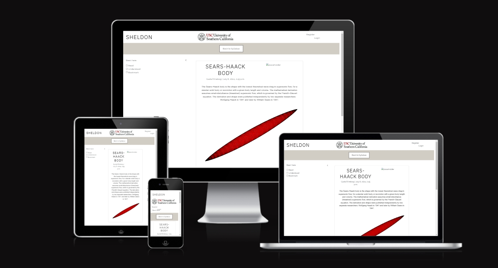

View the live site [here](https://sheldon-textbook-3b3e2a751d30.herokuapp.com/).

<span style="color:orange;font-weight:700;font-size:22px">
INTRODUCTION
</span>

**Sheldon** is a Learning Managment System (LMS) app for Educational Institutions. Where a teachers can place course content in a pre-made course template the students can access.

Special attention has been given to the UX of the app given special care to give the student a good overview and easy navigation of the course content so that the student can keep situtional awareness through out the course and not feel overwhelmed or lost!

<span style="color:#1591ea;font-weight:700;font-size:20px">
The seed to the idea
</span>

There seeds to the ideas for Sheldon are two:

1. As a University student and later lecturer at University in Math and Aeronautical Engineering I was disatisfied with the current alternatives and envisioned a tool that implemented my two ideas:
   - Topical modules should be created with different categories, theory, examples, equations, exercies etc. Once enough many modules in different categories, creating a new course would be as easy as stringing modules together like pearls on a string in a certain order. Since the modules would not be course specific, they would be reusable and creating a new similar course or modifying a current course would be as simple as to string together a new set of modules in a certian order or, in the case of modifying a course, to delete or add a few modules (perhaps write a few new modules) and perhaps rearrange the order of a few modules.
   - Secondly, introduce the concept of wiki-style hyperlinks (my original idea, I have to say with not so little pride, predates Wikipedia) so that not known or not understood concepts in a module quickly can be looked up in a differenet module before continuing in the current module. This feature would, if not completly overcome but, at least mittigate the catch-22 where two modules might require each other two have been studies before each other. This would represent a break with the linear appraoch where a read a book is read from cover to cover and be more like reading an encyclopedia where you jump back and forth between the different pages.

2. For as good as the Code Institute course content is I do have identified some room for improvement in its Learning Management Platform (see UX-section). By the way this is actually good news for CI since, despite there current high quality, they can become *even* better!

How do I develope a LMS that provide improves on these features to the user?

<span style="color:orange;font-weight:700;font-size:22px">
AGILE DEVELOPMENT
</span>

<span style="color:#1591ea;font-weight:700;font-size:20px">
User Stories
</span>

A Kanban board in Github projects was used for the Agile development process - see the board [here](https://github.com/users/GustafEnebog/projects/6).

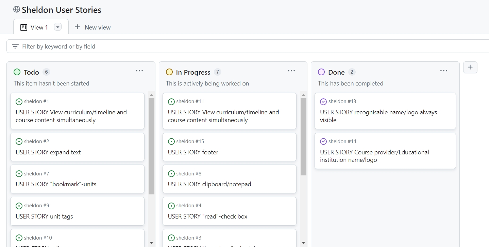

Initially ‘Epics’ were broken down into ‘User Stories’, which were further broken down into ‘Tasks’ according to below list however later more user stories where written and added to teh kanban-board.

THEME: ADMINISTRATION > EPIC: USER ACCOUNT

THEME: ADMINISTRATION > EPIC: ADMIN

THEME: STUDENT AID FEATURES > EPIC: CURRICULUM AND NAVIGATION

THEME: STUDENT AID FEATURES > EPIC: PACE CONTROL

THEME: STUDENT AID FEATURES > EPIC: EXPANSION/COLLAPSE TEXT

THEME: STUDENT AID FEATURES > EPIC: SITUATIONAL AWARENESS

THEME: STUDENT AID FEATURES > EPIC: CLIP BOARD

THEME: STUDENT AID FEATURES > EPIC: FEEDBACK

THEME: RELEASE > EPIC: TESTING

THEME: RELEASE > EPIC: DEPLOYMENT

<span style="color:orange;font-weight:700;font-size:22px">
USER EXPERIENCE (UX)
</span>

<span style="color:#1591ea;font-weight:700;font-size:20px">
Weakspots in Code Institute LMS
</span>

For all the quality that the CI educational material and LMS brings, there is nothing good that cannot become better. Below are a some points our design has identified as points for improvement:

*  No possibility for user to tag a unit according to how degree of completion, there is only a mark based on if you have visited the unti before or not!
* No way of navigate a "jump" to another part of the Syllabus without first having to leave the unit (since the Syllabus and units are separate views)
* Cannot open another unit in the same module in a new tab.
* Lack of timestamps and content description (so that I also can search the videos)
* Difficult to binge watch (you need four steps between each video: "close fullscreen", "scroll to next-button or lesson", "click start" and finally "click fullscreen!)
* Lack of categorisation of units (only two: video or text)
* No opportunity to leave memory notes on a teaching unit
* Screenshoots are to small in size to be able to read the code
* Resizing the window, like going from full screen (maximise button) to make the window smaller (restore button) makes the page scroll away from the place where you where in the text requiring user to scroll to refind his spot in the text.
* Poor responsivness: Not well suited for studiyng units on mobile

<span style="color:#1591ea;font-weight:700;font-size:20px">
Naming
</span>

The name for the app was chosen to be "SHELDON", an homage to my favorit character, Brainiac and phD student Sheldon Cooper and his group of academic friends in the popular sitcom "Big Bang Theory".

The app naming-ideation started with logic yet too generic and thus ultimatly boring names that did not stuck in memory. Thinking in terms of less generic and more personal theme accociated names led to the name "Einstein". This name however feelt to predictable and common yet it lead to think about alternative people with a similar quality. The name "Sheldon" is similar to "Eistein" yet less mainstream and less used making it more unique. For people not familiar with the TV-character it simply becomes a name.

| Name          | Short/Easy to say | Descriptive/associative | Non-generic | Memorable | Emotional/Personal | Emotional/Personal | 
|:------------- | :---- | :----: | :----: | :----: | :----: | :----: |
|  Ilearn | ✓ | ✓✓ |  |  | ✓ | 4 |
|  Digital textbook |  | ✓✓ | ✓ |  |  | 3 |
|  Binarybook | ✓ | ✓ | ✓ | ✓ | ✓ | 5 |
|  Learning Journey* |  | ✓✓ |  |  | ✓ | 3 |
|  Einstein| ✓ | ✓ |  | ✓ | ✓ | 4 |
|  Sheldon | ✓ | ✓ | ✓✓ | ✓✓ | ✓✓ | 8 |

A second, unintentional, quality of the name Sheldon is that it associates to Shell (in the meaning of a software shell) which the SHELDON app realy is, a shell for the course content.

<span style="color:#1591ea;font-weight:700;font-size:20px">
Layout and Wireframes
</span>

Low-fidelity wireframes were used to test the design before building the site.

A large amount of time was invested into figura out the optimal layout meeting the following goals:¨
* Clean uncluttered work space as to not draw attention away from the course content and overwhelm the student with graphic information.
* Consider grouping items that belong together in the same location

A difficult and desisive decision was if the integrated curriculum/timeline should be vertical (along left side of view port) or horizontal (underneath and along the header). It was first decided to have it horisontal on small screens and vertical on larger however an inconsistency between small and large screens was deemed confusing for users (=bad UX) so it was decided to make it horizontal on both screens. 

Large screen:

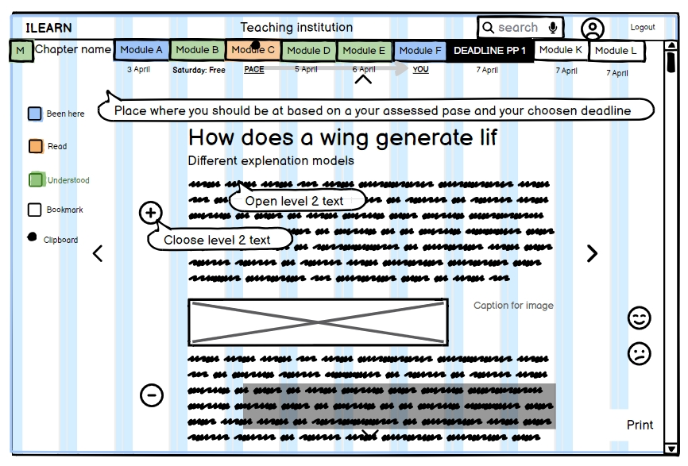
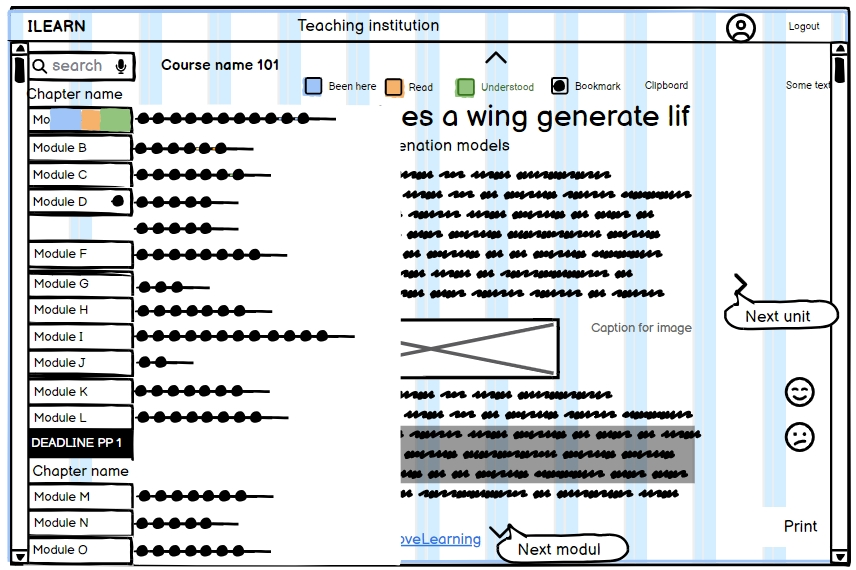

Small screen:

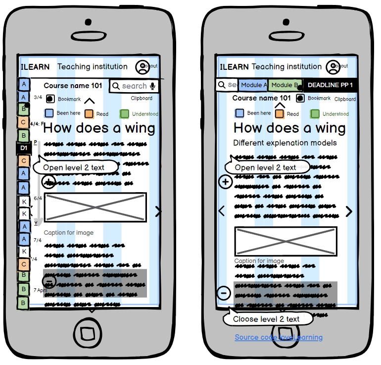

<span style="color:#1591ea;font-weight:700;font-size:20px">
Colour Scheme
</span>

The color scheme is very neutral where colors serve as much in the role of color coding as they do as accent colors.


The black & white (almost black, a very dark grey #212121 and normal white #ffffff) colour scheme of the app is to give a neutral base that does not compete with or clash with, the content (including images and film) or the color coding. The color coding was also limited and somewhat subdued in saturation as to not be overbearing to the all-important course content. 
Font color has been choosen to be this very dark grey mentioned above. This is actually the color that the font is presented with on the Google Fonts website (observed using a color picker). This color decreases contrast, but only by a little, and has been discovered to be less straining on the eyes.

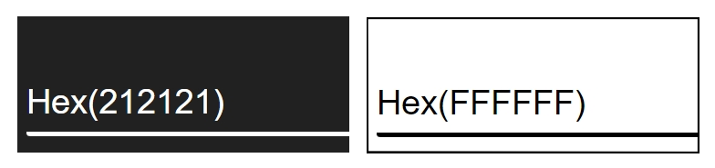

The color for the Syllabus units are: light grey for "Been there", low-saturation Blue for "Read" and High Saturation Blue for "Understood". Blue has been used here to distinguish the "situational awarenes" from the similar yet different green/orange pace control. Albeit green might appear to be an obvious choise however blue is similar in feel, just with a click more neutral feel.

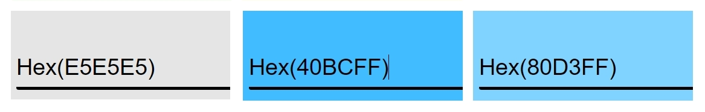

The color indicating your progress is green (you'r in the green!) if you are ahead and orange if you are behind (no color coding for "on pace"). The color Red was avoided since it could create stress and other negative emotions for the user. The slightly more relaxed orange is enough to communicate the message.  

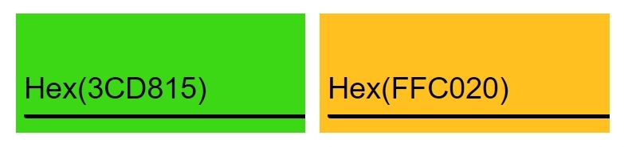

the colors Hue saturation/saturation and Value was carefully anually choosen according to the followng reasoning:
- The "colorless" light grey (zero saturation) was choosen to mark the relative low importance of only having "Been there"
- The "same hue" blue was choosen to mark that "read" and "understood" is in the same category
- The increase in hue going from low to high saturation blue indicate the increase in strenght when going from a only "read" to an "understood"
- The light grey and low-saturation Blue should "feel" similar in value, and only be differentiated by its hue.  
- The high saturation Blue should be as light (low value) as too keep contrast between text and background color.
- The green needed to decrese its value somewhat to match the orange. This seemed counterinutitive as different values would be needed to make the two colors match.

The unit categories are distinguisehed by using shape instead of color for the same reason as above to keep it cognitivly separate from the color coded "situational awarenes" and "pace controll".     

<span style="color:#1591ea;font-weight:700;font-size:20px">
Typography and app logo
</span>

The Raleway typeface (medium 500) is used for the whole app.  

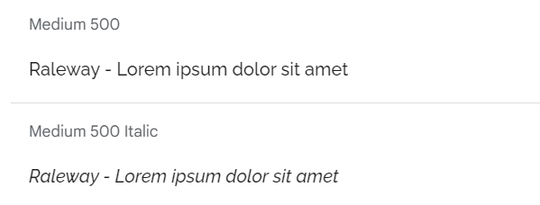  

Montserrat (medium 500) is used as a fall back font (and Sans-serif the third and last option).  

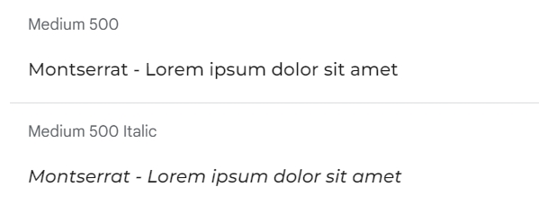  

The app logo is the name, SHELDON, in capital with the IBM Plex Sans typeface (medium 500 with SemiBold 600 for the favicon).  

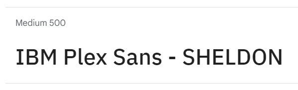

The conservative choise of limiting the number of fonts to only one is explained by that the app logo in the form of its name "SHELDON" also uses a typeface, and that the Eduational Institution filling Sheldon with their content also would have their logo on the page, most likely in the form of text with a typeface. This would potentially bring the total nr. of typefaces to three, hitting the limit to the "No more than 3 font"-rule.

Furthermore, Medium 500 has been used instead of the Regular 400 since recent research has shown that this slightly heavier is the most legible thickness. 


<span style="color:orange;font-weight:700;font-size:22px">
FEATURES
</span>

The database models are implemented according to the below Entity Relationship Diagram (ERD) With the exception for that I use the  module_id (instead of the module_slug as planned in the ERD) as a foreign key in the implementation.

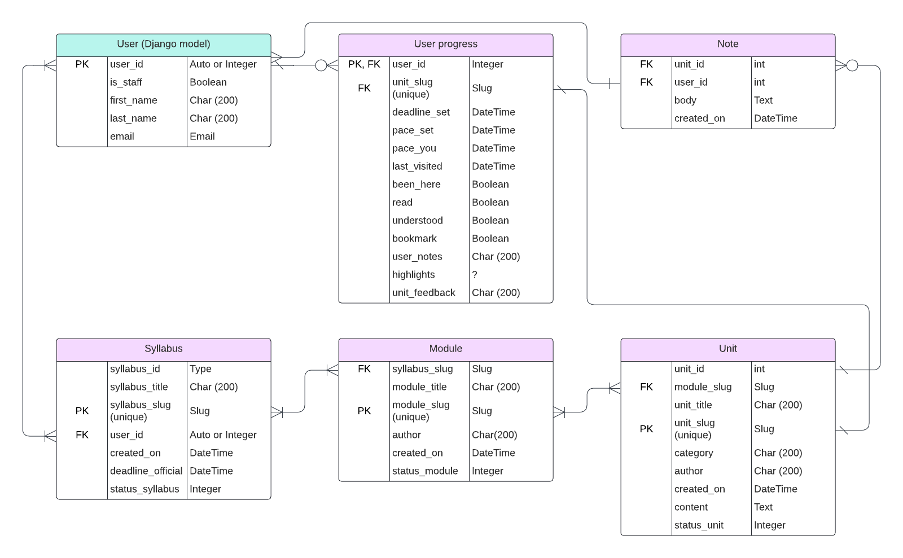

<span style="color:#1591ea;font-weight:700;font-size:20px">
Name/logo of Educational Institution (Header)
</span>

The logo of the name of the Eduational Institution ("University of Southern California" in my example) is currently hardcoded.


<span style="color:#1591ea;font-weight:700;font-size:20px">
Authentication
</span>

### Register and Login

The user can register or login by clicking on "Register" or "Login" top right in the Header. The user is then taken to a special Register or login page


### Log Out

Similar too the Register and Login the user can Logout by clicking on "Logout" to the top right in the header


<span style="color:#1591ea;font-weight:700;font-size:20px">
Syllabus with Units*
</span>

The course Syllabus is showing directly underneath the header and can almost be considered a part of the header since it is always showing or at least so it was intended but due to technical restrictions with Django Views the user need to return to this view with a back-button after each time having visited a view.

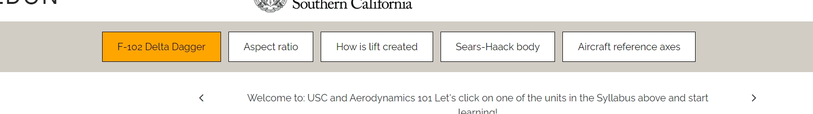

<span style="color:#1591ea;font-weight:700;font-size:20px">
Unit
</span>

The collection of teaching unit is the core of the app. A unit, is like the smallest headline in a textbook, e.g. "the Area-rule" which could be filled with text or images on a small topic. If another unit should wish to be selected the user first need to return to via the "Back to Syllabus"-button


<span style="color:#1591ea;font-weight:700;font-size:20px">
Note
</span>

A user can "take notes" at the bottom of each unit that will be saved so that the user can read his own notes when returning to a unit. These units are unique to one unit and one user so other users can not access each others notes. The notes should feature full CRUD (Create, Read, Update, and Delete)**

Click submit to save note:

<span style="color:red;font-weight:700;font-size:20px">
Warning the code throws an error (because of error on line 48 in single-unit-display.html) when saving however it does succesfully save!
</span>

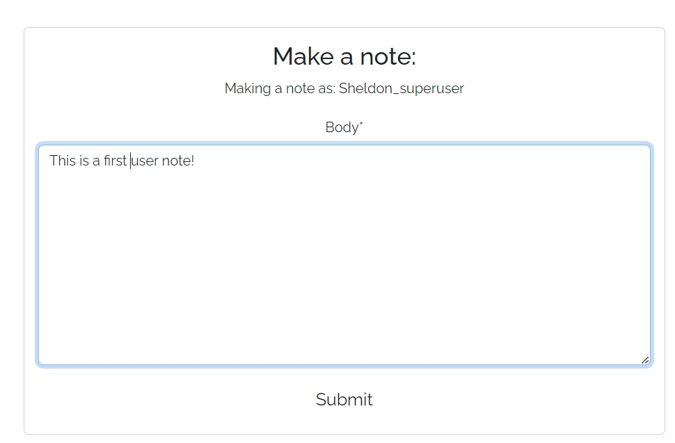

Confirmation that the note was succesfully saved!

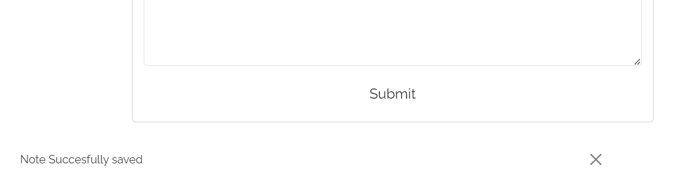

Here the user can edit his note (click "edit") or delete the note (click "delete"):

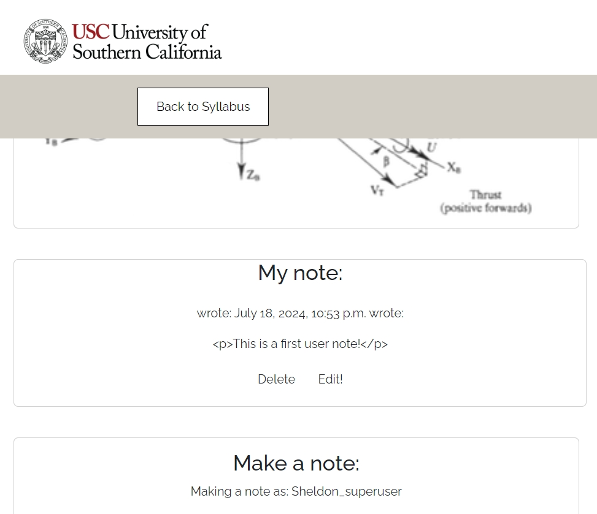

An extra safety questions before deleting note:

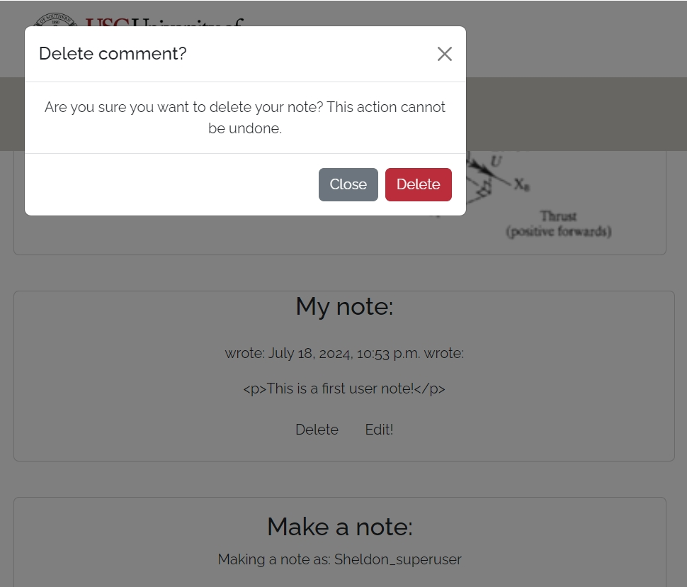

** Please see "Unfixed Bugs"

<span style="color:#1591ea;font-weight:700;font-size:20px">
Footer
</span>

The footer is divided into two sections, a left section where Sheldon related items, e.g. Social media links for the Sheldon Product is displaied and a middle/right section where the Eduational Institution that is using the Sheldon app can display its information, e.g. contact info.


<span style="color:#1591ea;font-weight:700;font-size:20px">
Error messages
</span>

Sheldon-themed error-pages has been create in order to somwhat mitigate the negative emotion that we all feel when hitting upon an error.

### "403 Error"-Page

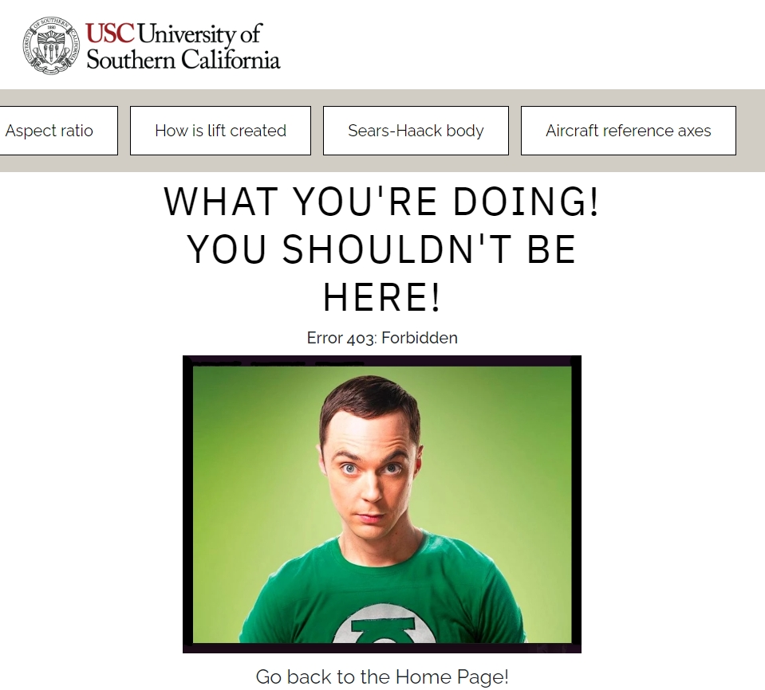

### "404 Error"-Page

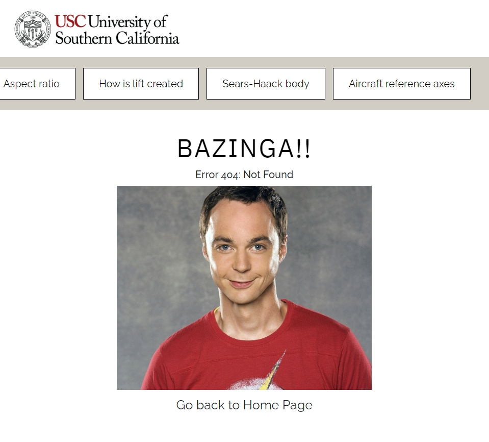

### "405 Error"-Page

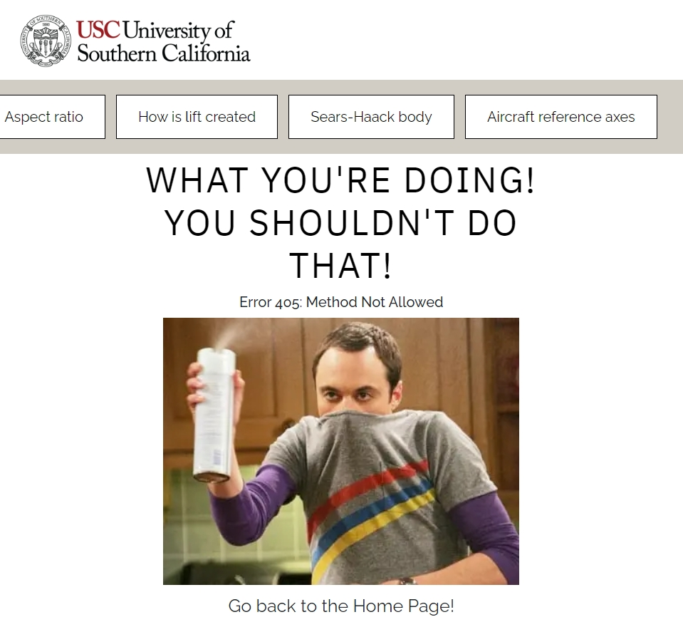

### "500 Error"-Page

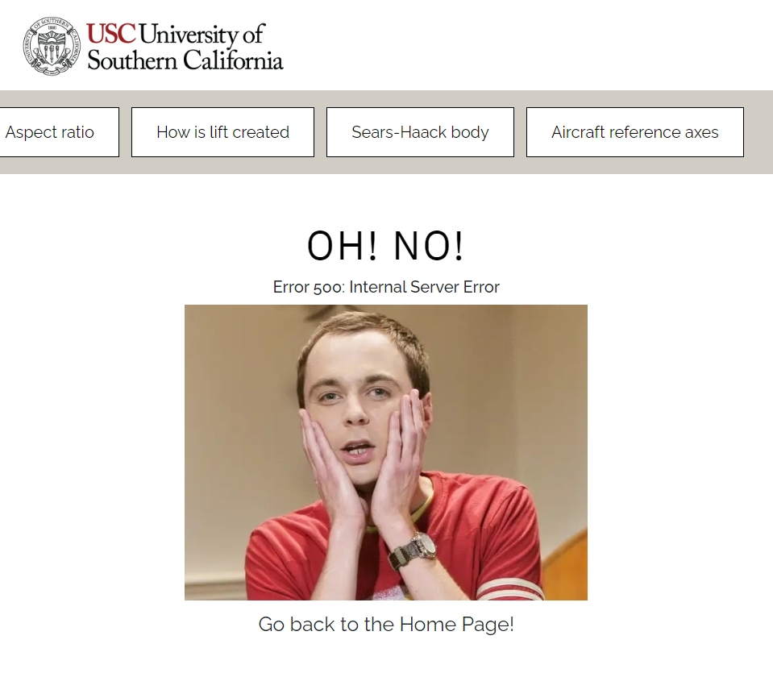


<span style="color:orange;font-weight:700;font-size:22px">
FEATURES TO IMPLEMENT IN THE FUTURE (Out of scoop features)
</span>

The necessary focus on achiving a Minimal Viable Product (MVP) has unfortunatly resulted in a unusually large "Features to implement in the future"-section

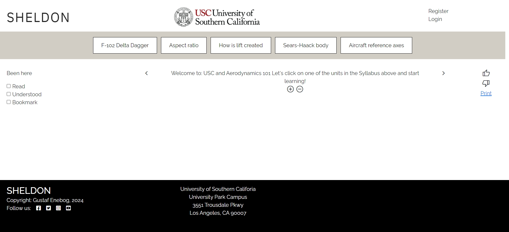

<span style="color:#1591ea;font-weight:700;font-size:20px">
Modules (within the Syllabus containing the Units) (Header)*
</span>

The course Syllabus is showing directly underneath the header and can almost be considered as a part of the header since it is always showing or at least so it was intended but due to technical restrictions with Django Views the user need to return to this view with a back-button after each time having visited a view. Please see more on the planned (but not yet implemented) features in the "Features to implement in the future"

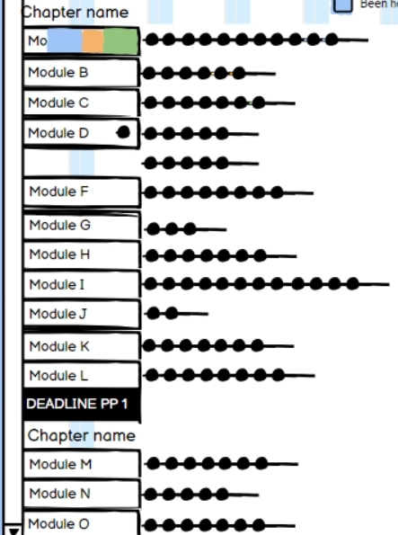

<span style="color:#1591ea;font-weight:700;font-size:20px">
Pace Control (Header)*
</span>

The pace control gives the user:
*	the date for the official deadline as well as a user set deadline
*	Remaining time until the official deadline as well as a user set deadline
*	Necessary pace to make the deadline as well as a user set deadline in the form of:
    - Number of units to do per day, or if that number is less then one: Number of days per units

Pace control should also calculate the average time you spend on a unit, average this out and base average time spent on a unit based on a smart algorithm utilysing this data.

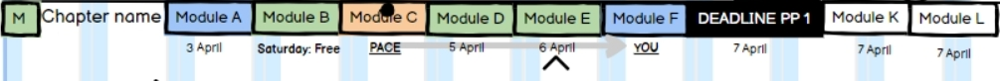


<span style="color:#1591ea;font-weight:700;font-size:20px">
Situational Awarenes*
</span>

the Situational Awareness-"panel" helps the user keep track of where he has been and what he has done on each unit. Each unit has a text/checkbox where the user can indicate how much of the unit he has completed as well as to remember units if he want to return to them in the future. This gives the user a sense of "Situational Awareness" for the course:

•	"Been here" - Text appears automatically from the first time (and onwards) the user visits the unit
•	"Read" - User can check this checkbox once he has read yet not understood the unit (and therefore need to return to it later).
•	"Understood" - User can check this checkbox when he considers himself "finished" with the unit. The "Read"-checkbox will be automatically checked (if it was note already by the user) when the "Understood"-checkbox is checked.
•	"Bookmark" - User can bookmark pages for future refence

This will be reflected with color coding of the units in the Syllabus:

•	Original state - background color: #FFFFFF
•	"Been here" - background color: #E5E5E5
•	"Read" - background color: #40BCFF
•	"Understood" - background color: #80D3FF
•	"Bookmark" - border color: #FFC020

A positive side-effect of the "Situational awareness"-checkboxes is the satisfying dopamin-reward the user recieves as he checks away ...one more unit, kind of reading "just one more page" in a suspensfull book! The progress becomes concrete and visible! Furthermore The "pace control"-feature is using this user-provided data for its calculations.

```html
<div class="col-sm-3 ps-0">
    <div style="background-color: white" id="Situation-awareness">
        <p>Been here</p>
        <!-- Make Toggle between hidden and not hidden depending on a fetsch saying user has been on unit or not-->

        <input type="checkbox" id="unit-state-1" name="unit-state-1" value="Read"
            onclick="displayDate(); colorCoding()">
        <!-- <p id="demo"></p>-->
        <label for="unit-state-1">Read</label><br>

        <input type="checkbox" id="unit-state-2" name="unit-state-2" value="Understood"
            onclick="displayDate(); colorCoding()">
        <label for="unit-state-2">Understood</label><br>

        <input type="checkbox" id="unit-state-3" name="unit-state-3" value="Bookmark"
            onclick="displayDate(); colorCoding()">
        <label for="unit-state-3">Bookmark</label><br>
        <!-- <button class="situ-aware-button">Clipboard</button> -->
    </div>
</div>
```

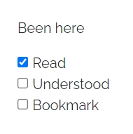

\* This feature is good for all students but especially important for students with a neurodivergent diagnosis such as Asperger syndrome where the structure need to be extremely clear and distinct.  

<span style="color:#1591ea;font-weight:700;font-size:20px">
Clip Board
</span>

This feature is similar to the Note-featuer yet instead of allowing the user to write his notes, this features allows the user to mark text in the unit, click a button and having this text saved down onto a digital clipboard for future reference. 


<span style="color:#1591ea;font-weight:700;font-size:20px">
2D Navigation arrows*
</span>

As a secondary method of navigating between the different units the user can click on a left or right arrow to toggle between different modules together with an up and down arrow to to toggle between different units. These arrows are overlaid on top of the unit and should stay put indipendent of scrolling. The arrows are made thinn and with a 50% opacity as to not disturb the view when the up and down arrow sits on top of the text. however a larger also opaque grey circle will appear underneath the arrow on hoover. 

```html
<div style="background-color:white">
<span class="material-symbols-outlined">
    keyboard_arrow_left
</span>
</div>

<div style="background-color:	white">
    <span class="material-symbols-outlined">
        keyboard_arrow_right
    </span>
</div>
```
Below image showing horizontal arrows.

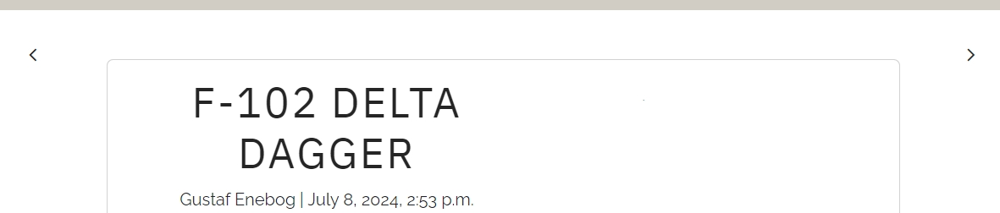


<span style="color:#1591ea;font-weight:700;font-size:20px">
Unit categories
</span>

A teaching unit, or simply a unit, is like the smallest headline in a textbook, e.g. "the Area-rule" which could be filled with text or images on the topic.

Pace control should also calculate the average time you spend on a unit, average this out and base average time spent on a unit based on a smart algorithm utilysing this data.

•	Introduction
•	Cheat sheet
•	Module recap     
•	Review
•	Dependent Context unit
•	User defined
•	Headlines
•	Photos
•	Videos
•	Formulas
•	Links
•	Etc.

Please see: "Features to implement in the future" for a description of planned features for the Unit


<span style="color:#1591ea;font-weight:700;font-size:20px">
Hyperlinks
</span>

The Unit content holds Wiki-style hyperlinks that, when the user click on them, takes him to a different unit relating to the topic in the original unit visited. These hyperlinks are key in the concept of being able to freely combine and order free standing learning units since the hyperlinks can bridge the gap between units that requires each others content being read before each other (catch-22).

These hyperlinks are to be created both automatically (when a word in a unit matches exactly the title of another unit) as well as manualy. Automatically created hyperlinks should also be possible to remove manually. Functionality that would recognise close, yet not exact unit title, matches (regex) asking the admin if a "non-exact"-hyperlink (possibly with another color to mark that it is a "related" and not an exact word hyperlink)

Example from Wikipedia:

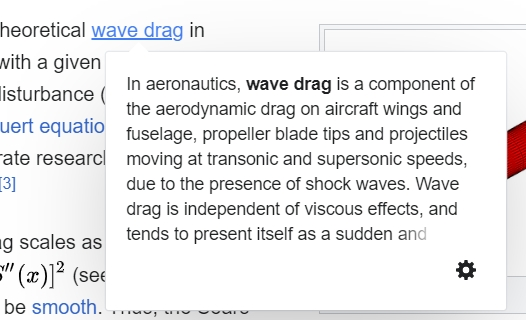


<span style="color:#1591ea;font-weight:700;font-size:20px">
Two level deep expansion/collapse text (accordian)
</span>

By clicking a plus icon next to the paragraphs the text below the plus sign slides down and makes space for more, previously hidden, text. This feature can "un-hide" text two levels down and vice versa (by clicking a minus sign).

In order to not overwhelm the student, this feature will unclutter the teaching material which will help the student to see what is important and what is less important. It also helps the Admin/teacher to make a course Syllabus including much deepth (including two levels deep expansion text) in some areas yet only touching on other areas (not opening any expansion text)

As a positive side effect it can make learning more fun by intriguing the student to find what is hiding behind that expand button.

Example of a expansion/collapse text:

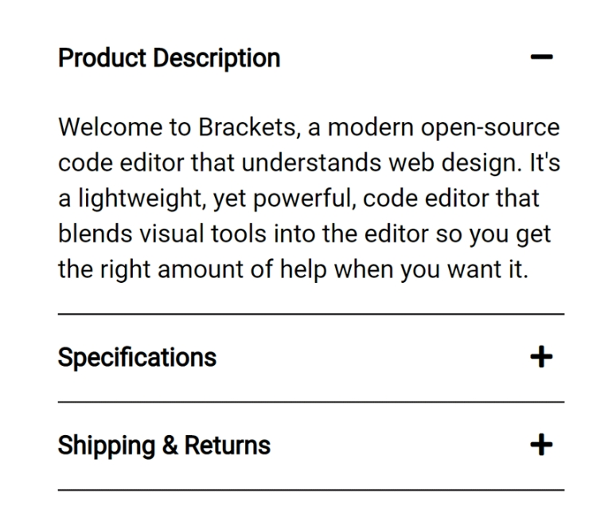

Code for add-icon (to expand text) and subtract-icon (to collapse text)

```html
<!-- Google font Add Circle -->
<span class="material-symbols-outlined">
    add_circle
</span>
<!-- END OF: Google font Add Circle -->
<!-- Google font subtract Circle -->
<span class="material-symbols-outlined">
    do_not_disturb_on
</span>
<!-- END OF: Google font subtract Circle -->

```

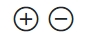

<span style="color:#1591ea;font-weight:700;font-size:20px">
Feedback
</span>

Each unit displays a "thumbs up" and a "thumbs down" icon where the user can rate his experience with the unit. If the user want to give more detailed feedback, perhaps top point out a difficult to understand passage in the unit he can also click on "Write feedback" upon which a textfield on a modal screen opens up for the user to comment further.

```html
  <!-- Google font thumb_up -->
  <div class="material-symbols-outlined">
      thumb_up
  </div>
  <br>
  <!-- END OF: Google font thumb_up-->
  <!-- Google font thumb_down -->
  <div class="material-symbols-outlined">
      thumb_down
  </div>
  <br>
  <!-- END OF: Google font thumb_down-->
```

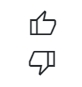

<span style="color:#1591ea;font-weight:700;font-size:20px">
Miscellanious functionality
</span>

* From admin panel: Upload Course provider logo to be displayed
* Tool tips on modules and units
* Search (between modules and units)
* Password reset: add ability to reset password.
* Social sign-in: allow users to sign in with their Google/Apples/etc. accounts.


<span style="color:orange;font-weight:700;font-size:22px">
TECHNOLOGIES AND DESIGN PRINCIPLES
</span>
<span style="color:#1591ea;font-weight:700;font-size:20px">
Design principles used
</span>

- Languages:
    - Python
    - HTML5
    - CSS3
    - JavaScript
- >Patterns:
    - Model-View-Controller (MVC)
- Design Thinking:
    - Empathise-Questions-Examine
    - Seperation of Concerns
    - KIS - Keep It Simple
    - YAGNI - You aren't gonna need it
    - DRY (Don't Repeat Yourself)
- Agile:
    - User Stories
    - JavaScript
    - HTML5
    - CSS3

<span style="color:#1591ea;font-weight:700;font-size:20px">
# TECHNOLOGIES USED
</span>

- Languages:
    - Python
    - JavaScript
    - HTML5
    - CSS3
- Framework:
    - Django
- Database:
    - PostgreSQL
- [Git](https://git-scm.com/) - for version control (using the Gitpod IDE).
- [GitPod](https://www.gitpod.io/) - IDE for creating code.
- [GitHub](https://github.com/) - for storing the project.
- [PostgreSQL from Code Institute](https://dbs.ci-dbs.net/) - PostgreSQL as a service.
- [Heroku](https://www.heroku.com/) - to deploy the application.
- [Summernote](https://summernote.org/) - to provide a simple WYSIWYG bootstrap-based editor for the Django admin page.
- [Cloudinary](https://cloudinary.com/) - to host the static files.
- [Chrome Developer Tools](https://developer.chrome.com/docs/devtools/) - to test responsiveness, edit CSS code, debug JavaScript and generate Lighthouse reports.
- [Google Fonts](https://fonts.google.com/) - to import the site font, ‘Oswald’.
- [Balsamiq](https://balsamiq.com/) - to create the wireframes.
- [Font Awesome](https://fontawesome.com/) - for all the site icons.
- [Favicon](https://favicon.io/) - for the favicon.
- [Coolers](https://coolers.co/) - for an overview of the chosen colour palette.
- [Am I Responsive](https://ui.dev/amiresponsive) - to create the responsive demo image at the top of the Readme.
- [Lucidchart](https://www.lucidchart.com/pages/) - to create the database schemas.
- [Code Institute’s Python Linter](https://pep8ci.herokuapp.com/) - for automated testing of the Python code.
- [JSHint](https://jshint.com/) - to test the JavaScript code.
- [W3C Markup Validator](https://validator.w3.org/) - to test the HTML code.
- [W3C CSS Validator](https://jigsaw.w3.org/css-validator) - to test the CSS code.

<span style="color:#1591ea;font-weight:700;font-size:20px">
Python Packages Used
</span>

- [django-allauth](https://docs.allauth.org/en/latest/index.html) - for user authentication.
- [gunicorn](https://gunicorn.org/) - as the HTTP server that allows Django to run on Heroku.

<span style="color:orange;font-weight:700;font-size:22px">
TESTING
</span>

<span style="color:#1591ea;font-weight:700;font-size:20px">
Automated Testing
</span>


**Python Linting**

Python linting was carried out with https://pep8ci.herokuapp.com/.

There were no warnings left in the production code apart from the ‘line too long’ errors on the boilerplate Django code in ‘settings.py’.

**JavaScript Linting**

All JavaScript files were tested with [JSHint](https://jshint.com/) No errors are present in the production code. There was 19 warnings however they all where only in regards to javascript versions.


**CSS Validation**

The CSS file was validated with [W3C CSS Validator](images-for-readme/jigsaw-css-validation.jpg). No errors are present in the production code. There was x (!) warnings of the type:  
- "Due to their dynamic nature, CSS variables are currently not statically checked"  
- "...is a vendor extension"  
- "Same color for background-color and border-color"  

View the validation result for my site [here](http://jigsaw.w3.org/css-validator/validator?lang=en&profile=css3svg&uri=https%3A%2F%2F8000-gustafenebog-sheldon-snyii1xvpkq.ws.codeinstitute-ide.net%2F&usermedium=all&vextwarning=&warning=1).

**HTML Validation**

All pages were validated by the [W3C Markup Validator](https://validator.w3.org/). No errors are in the production code.

To overcome the errors that the Django tags would bring up, the pages were tested by selecting ‘View Page Source’ in Chrome and copying the rendered HTML into the validator.

**Lighthouse Testing**

All pages were tested with Google Chrome’s Lighthouse. The low score on best practise was due to "Uses deprecated APIs" in the form of locally installed "Kasperski".

Syllabus page(Home Page):

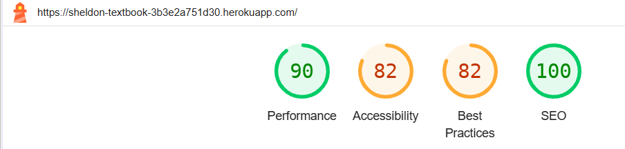

Unit page (sears-haack-body):

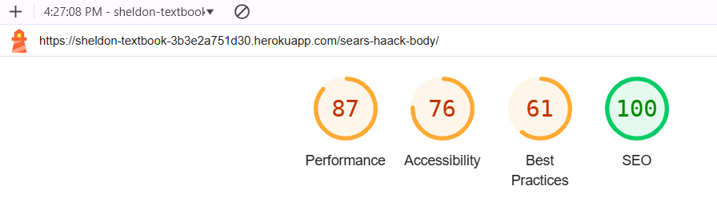


**WebAIM WAVE, Web Accessibility Testing**

All pages were tested with the [WAVE tool](https://wave.webaim.org/).

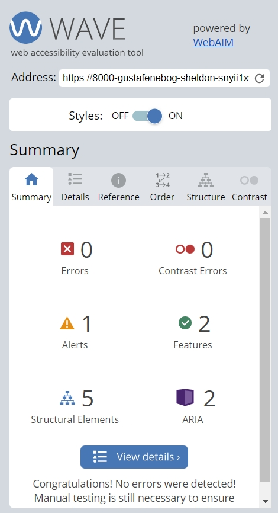
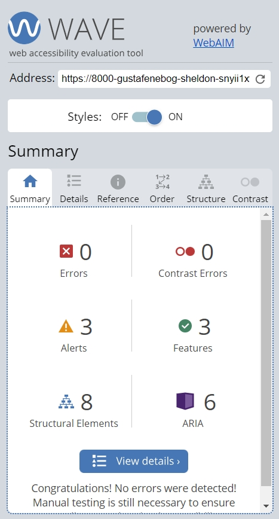

<span style="color:#1591ea;font-weight:700;font-size:20px">
User Stories Testing
</span>

All user stories were tested to confirm that they meet their Acceptance Criteria. The following have all PASSED.

(View the EPICS, User Stories, Acceptance Criteria and Tasks on the GitHub [Kanban Board](https://github.com/users/GustafEnebog/projects/1/views/1?layout=board).


### THEME: Administration > EPIC: User Account

- As a **user** I can **sign up and log in** to the site to **View Modules/Units with pace control, check "Situational Awareness"-boxes, add notes on "Clipboard" and give "feedback"**.  

  **AC1** Then personal information can be added to the user profil -<span style="color:yellowgreen;"> **PASS**</span>  
**AC2** Then a profile image can be added -<span style="color:orangered;"> **-**</span>  
**AC3** Then a user can sign in with username/password -<span style="color:yellowgreen;"> **PASS**</span>  
**AC3** Then a user can sign in with Social Network -<span style="color:orangered;"> **-**</span>  


### THEME: Administration > EPIC: Admin

- As an **admin** I can **create, read, update and delete (CRUD) Modules/Units**, to **create the content for a course**.  

  **AC1** Then course content can be created in Django Admin panel -<span style="color:yellowgreen;"> **PASS**</span>  
**AC2** Then course content can be read in Django Admin panel -<span style="color:yellowgreen;"> **PASS**</span>  
**AC3** Then course content can be updated in Django Admin panel -<span style="color:yellowgreen;"> **PASS**</span>  
**AC4** Then course content can be deleted in Django Admin panel -<span style="color:yellowgreen;"> **PASS**</span>  

- As an **admin** I can **check a "Draft"-check box**, to **prohibit it from being released as well as to signal this "Draft"-stage to admin**.  

  **AC1** Then a course unit can be flagged as "Draft" in the Django admin panel -<span style="color:yellowgreen;"> **PASS**</span>  
**AC2** Then a "Draft"-flagged unit in the Django admin panel is not eligable for publishing  -<span style="color:yellowgreen;"> **PASS**</span> 

- As an app **admin** I can **put together a course by selecting a number of units and stringing them together in a certain order within  Modules (like chapters in a book)**, so that I can **create a course curriculum**.  

  **AC1** Given a logged in user, they can save a draft noted -<span style="color:yellowgreen;"> **PASS**</span>  
**AC2** Then they can finish the content at a later time -<span style="color:yellowgreen;"> **PASS**</span>  

- As an app **admin** I can **view a list of all Modules/Units and be able to create a course content by choosing a number modules, order them and populate them with a number of units and ordering these units**, so I can **create a course curriculum**.

  **AC1** Given a logged in admin, they can view a list of all *modules* -<span style="color:yellowgreen;"> **PASS!**</span>  
**AC2** Given a logged in admin, they can view a list of all *units* -<span style="color:yellowgreen;"> **PASS!**</span>  
**AC3** Given a logged in admin, they Choose a number of units for a course -<span style="color:yellowgreen;"> **PASS!**</span>  
**AC4** Given a logged in admin, they Choose a number of modules for a course -<span style="color:yellowgreen;"> **PASS!**</span>  
**AC5** Given a logged in admin, they can "populate" the selected modules with selected number of units for a course -<span style="color:yellowgreen;"> **PASS!**</span>  


### THEME: Students and Features > EPIC: Syllabus and Navigation

- As a **user** I can **view and navigate all Modules and Units in a Syllabus** to easily be able to **see where I currently am at in the Curriculum/course content.**

  **AC1** Distinguishing unit-category with category unique-icons -<span style="color:yellowgreen;"> **PASS**</span>  
**AC2** Tool tips on Module/Units -<span style="color:orangered;"> **-**</span>  
**AC3** Navigate between Modules by clicking on horizontal left and arrows that stays put in the middle, vertically, of the screen independent of scrolling -<span style="color:orangered;"> **-**</span>  
**AC4** Navigate between Units by clicking on vertical up and down arrows that stays centered on the screen independent of scrolling -<span style="color:orangered;"> **-**</span>  
**AC5** Course name is always visible independent of which unit I am currently on -<span style="color:yellowgreen;"> **PASS**</span>  

- As a **user** I can **have different units open in the same browser (but in different tabs) from the same course as well as separate courses** so that **I do not need to close one course before opening the next.**  
**AC1**  I can right click a unit and select "open link in new tab" or "open link in new window" -<span style="color:yellowgreen;"> **PASS**</span>  

- As a **user** I can **carrie out a normal text search of the Module/Unit names and unit contents** so that **I am able to find myself back to earlier course content that I need to revisite.**
**AC1**  I can search for Module and Unit *titles* -<span style="color:orangered;"> **-**</span>  
**AC2**  I can search for Module and Unit *contents* -<span style="color:orangered;"> **-**</span>  

### THEME: Students and Features > EPIC: Pace Control

- As a **user** I can **set my own deadline and view my pace according to this and the number of "Understood" and "Read" units (See: Situational Awareness), one "Read" count as half of one "understood"** so that **I can see if I am on pace, ahead or behind and by how much based on both the official and user selected deadline.**  

  **AC1** Set my own deadline -<span style="color:orangered;"> **-**</span>  
**AC2** View the "correct" pace (shown as "PACE" at the Unit where you should be at) according to the deadline (User selected deadline or official deadline if user-selected deadline has not been set) -<span style="color:orangered;"> **-**</span>  
**AC3** View your pace (shown as "YOU") at the Unit where you should be at according to the deadline and number of Units with "Situational Awareness"-Check boxes checked (User selected deadline or official deadline if user-selected deadline has not been set) -<span style="color:orangered;"> **-**</span>  
**AC4** Arrow between "PACE" and "YOU" (Green if "PACE" is behind you and Orange (at first and then Red as distance increases) if "PACE" is in front of you) -<span style="color:orangered;"> **-**</span>  
**AC5** View average time on unit before "Read" checkbox is checked -<span style="color:orangered;"> **-**</span>  
**AC6** View a "PACE"-date (the date the unit should be done to be on pace) for each unit  -<span style="color:orangered;"> **-**</span>  
**AC7** Include warning if deadline is set to a date after that of the official deadline  -<span style="color:orangered;"> **-**</span>  

- As a **user** I can **view my average time as well as that of the average student, on each individual unit before a checkmark in the "read" and "understood" checkbox are clicked respectively and see my pace and expected finished date (relative to the deadline)** so that **I can recieve some extra pace information in addition to (and independent of) the other pace control**.  

  **AC1** View average time on unit before "Read" checkbox is checked -<span style="color:orangered;"> **-**</span>  
**AC2** View average student time on unit before "Read" checkbox is checked -<span style="color:orangered;"> **-**</span>  
**AC3** View average time on unit before "Understood" checkbox is checked -<span style="color:orangered;"> **-**</span>  
**AC4** View average student time on unit before "Understood" checkbox is checked -<span style="color:orangered;"> **-**</span>  

### THEME: Students and Features > EPIC: Expansion/Collapse text

- As a **user** I can **click on a plus sign to expand collapsed text (two levels deep)** So that **I can access more in-depth text after having understood the fundamental text first** to the site to.  

  **AC1** User can expand one individual "expansion text" to the *first* level by clicking a plus sign at the spot of the expansion text -<span style="color:orangered;"> **-**</span>  
**AC2** User can expand one individual "expansion text" to the *second* level by clicking a plus sign at the spot of the expansion text -<span style="color:orangered;"> **-**</span>  
**AC3** User can expand *all* "expansion text" to the *first* level by clicking on one "expand all"-button -<span style="color:orangered;"> **-**</span>  
**AC4** User can expand *all* "expansion text" to the *second* level by clicking on one "expand all"-button -<span style="color:orangered;"> **-**</span>  

- As a **user** I can **click on a minus sign to collapse expanded text (two levels deep)** So that **the expanded more detailed text do not clutter and overwhelm the learning process.**

  **AC1** Users can create an account with a Sign Up page -<span style="color:yellowgreen;"> **PASS**</span>  
**AC2** Users can log in with a Log In page -<span style="color:yellowgreen;"> **PASS**</span>  
**AC3** Users can log out with a Log Out Page -<span style="color:yellowgreen;"> **PASS**</span>  


### THEME: Students and Features > EPIC: Situational Awareness

- As a **user** I can **view an automaticaly updated "been here"-marks and a last visited-mark in the syllabus and on the unit I am currently visiting**, to easily **see what units I have visited earlier at some point in time**.

  **AC1** A "Been here"-mark is automatically added to a unit in the Syllabus and stays even after having loged out and in again. -<span style="color:orangered;"> **-**</span>  
**AC1** A "Last visited"-mark is automatically added to a unit in the Syllabus that was last visited. This mark will constantly be "assigned" to different units and can only be "assigned" to one unit at a time. -<span style="color:orangered;"> **-**</span> 

- As a **user** I can **check a "read"- and an "understood"-checkbox (if the "read"-checkbox is unchecked as the "understood" checkbox gets checked it automatically get checked) which I also can view in the curriculum and on the unit I am currently on**, to **keep an improved sense of situational awareness in regards to what units I still need to return to.**.

  **AC1** User can select "Read"-checkbox -<span style="color:orangered;"> **-**</span>  
**AC2** When a "Read"-checkbox is checked a "Read"-color coding appears on the unit in the Syllabus -<span style="color:orangered;"> **-**</span>  
**AC3** User can select "Understood"-checkbox -<span style="color:orangered;"> **-**</span>  
**AC4** When a "Understood"-checkbox is checked a "Understood"-color coding appears on the unit in the Syllabus -<span style="color:orangered;"> **-**</span>  
**AC5** If the user selects the "Understood"-checkbox without first having selected the "Read"-checkbox the "Read"-checkbox gets checked also -<span style="color:orangered;"> **-**</span>  

- As a **user** I can **see how many percent of the units (graphically as a gradually filled bar and as an number) that has had its "understood"-checkbox checked! (and the same for the "been here"- and "read"-checkboxes)** so that I can **see how many units remain to be "read" and "understod" independently of the chronological pace**.

  **AC1** Add persent as a *number* to "Been here", "Read" and "Understood" -<span style="color:orangered;"> **-**</span>  
**AC1** Add persent as a *graphical bar* to "Been here", "Read" and "Understood" -<span style="color:orangered;"> **-**</span>  

- As a **user** I can **bookmark a unit and view a mark on bookmarked units**, to **keep a record of extras important units that I might want to return to later**.

  **AC1** User can click a "bookmark" check box. -<span style="color:orangered;"> **-**</span>  
**AC2** 'User can view a "bookmark"-mark on units in Syllabus. -<span style="color:orangered;"> **-**</span>  


### THEME: Students and Features > EPIC: Clip Board

- As a **user** I can **write, edit or delete text on a clipboard**, to **take notes relating to the individual units**.

  **AC1** User can click on "Clipboard"-button to have clipboard appear on a modal screen -<span style="color:orangered;"> **-**</span>  
**AC2** Clipboard can be used for writing and editing notes with a basic editor -<span style="color:orangered;"> **-**</span>  
**AC3** I can delete the clipboard by deleting all the content on the Clipboard -<span style="color:yellowgreen;"> **PASS**</span>  
**AC4** Clipboard can be used for deleting notes with a basic editor - -<span style="color:yellowgreen;"> **PASS**</span>  

- As a **user** I can **mark text, images etc. in the untis and have it stay marked also when I come back to a page after having left it or having loged out and loged in again as well as having the marked text appear on the clipboard**, to **to have **.

  **AC1** When text, formulas, images etc. are marked in a unit, the mark becomes permanent also after the user have logged out and back in again. -<span style="color:orangered;"> **-**</span>  
**AC2** Marked text automatically appears on the clipboard and stay there also after the user have logged out and back in again. -<span style="color:orangered;"> **-**</span>  
**AC3** Marked text can be deleted from the unit and clipboard simultaniously by marking the marked text again and clicking delete. -<span style="color:orangered;"> **-**</span>  


### THEME: Students and Features > EPIC: Feedback

- As a **user** I can **give user feedback on each unit by clicking a thumbs up or down icon as well as leave a comment in a text field**, to easily **allow a quality improving feedback loop to the content creators**.

  **AC1** I can click on a thumbs up or down icon -<span style="color:orangered;"> **-**</span>  
**AC2** The count of thumbs up or down icon can be vied by the admin on the admin page -<span style="color:orangered;"> **-**</span>  


### THEME: Release > EPIC: Testing and Error Handling

- Add and update the about text: As a Site Admin, I can create or update the about page content so that it is available on the site.

  **AC1** The About app is visible in the admin panel -<span style="color:yellowgreen;"> **PASS**</span>  


- As a **user** I will **see a humorous 404 and 500 error page when in the case of a "not found" or "server error" respectivly **so as to somewhat cut the edge of my frustration and lighten my mood to continue using the app**.

  **AC1** A 404 page is created and "connected" -<span style="color:yellowgreen;"> **PASS**</span>  
**AC2**  A 500 page is created and "connected" -<span style="color:yellowgreen;"> **PASS**</span>  


### THEME: Release > EPIC: Deployment

- As a **developer** I can **deploy to a hosting service**, so that **the site is available to the public**.

  **AC1** Functioning deployment to Heroku -<span style="color:yellowgreen;"> **PASS**</span>  


<span style="color:#1591ea;font-weight:700;font-size:20px">
Manual Testing
</span>


| Action         | Expected result | Outcome | 
|:------------- | :---- | :----: | 
|  Open landing/home page | home page loads with welcome message in place of unit  | <span style="color:yellowgreen;"> **PASS**</span> |
|  Sign up by navigating to sign up link | Styled sign up page loads and accepts user inputs / user recieves emailconfirmation  | <span style="color:yellowgreen;"> **PASS**</span> |
|  Login by navigating to login | login page loads and accepts user input / user is logged in upon giving correct username and password  | <span style="color:yellowgreen;"> **PASS**</span>  |
|  Use and access "Notes" as a logged in user | user have can write new, and have access to previously written, unit specific notes  | <span style="color:yellowgreen;"> **PASS**</span>  |
|  Add Syllabuses, Modules and Units when loged in as an Admin | The changes are reflected in the app  | <span style="color:yellowgreen;"> **PASS**</span>  |
|  Edit Syllabuses, Modules and Units when loged in as an Admin | The changes are reflected in the app  | <span style="color:yellowgreen;"> **PASS**</span>  |
|  Delete Syllabuses, Modules and Units when loged in as an Admin | The changes are reflected in the app  | <span style="color:yellowgreen;"> **PASS**</span>  |
|  Navigate to a Unit | when clicking on a selected user-button I am taken that selected unit | <span style="color:yellowgreen;"> **PASS**</span>  |
|  Navigate from a Unit back to the Syllabus | when clicking on the return button I am taken back to the Syllabus | <span style="color:yellowgreen;"> **PASS**</span>  |


The following devices and browsers were used for manual & responsive UI testing.

- iPhone 11 (2020)
    - Safari (v16)
    - Chrome (v114)
- Think Pad P1
    - Chrome (v126)
    - Firefox (v127)

<span style="color:orange;font-weight:700;font-size:22px">
# BUGS
</span>

<span style="color:#1591ea;font-weight:700;font-size:20px">
Fixed Bugs
</span>

| Bug | Fix |
| --- | --- |
| ‘name conflict’ error bug: The detailed View (unfortunatly named "Unit" which was the same as the name of a model) would throw a "Not found" | Changing the name of the view (to: UnitListView) so that it would no longer be the same as the model name (keeping the name for the model: Unit) |
| ‘wrong template "Extended" into base.html’ error bug: Error inserting the correct template due to Jinga reading commented away code (Template language). | Deleting commented away code from the file |
| ‘Google icons loading time’ error bug: The loading time for the seven Google font Material Symbol (Variable Icon font) is ca 3 min (loading time increase linearly with number of icons on the page so is ca 30 min for one single icon). | Fill in Fix here. |

<span style="color:#1591ea;font-weight:700;font-size:20px">
Unfixed Bugs
</span>

| Bug |
| --- |
| - |
| The notes are displayed at the moment without showing any paragraph breaks that can be seen inside the Django admin panel. |

<span style="color:#1591ea;font-weight:700;font-size:20px">
Code Outtakes
</span>

The following code snippets represent part of the code that had to be taken out since the backend implementation not yet having been completed for the the "situational awareness" and the "pace control"-features as well as handling situation when no units yet has been written:


Feature: Pace Control

```js
import datetime

def __number_of_units_or_days__(self):
    from datetime import date

    today = date.today()
    deadline_official = date(2025, 2, 10)
    days_to_deadline_official = deadline_official - today
    print(days_to_deadline_official.days)

    int units_per_day = null
    int days_per_unit = null

    remaining_units = 12 # replace later with automatically calculated units
    if remaining_units >= days_to_deadline_official.days
        units_per_day = remaining_units / days_to_deadline_official.days
    elif remaining_units > days_to_deadline_official.days
        days_per_unit = days_to_deadline_official.days / remaining_units

    print(units_per_day, days_per_unit)
```
Feature: Situational awarenes: "Been here"- unhide

```js
function beenHereFetcher() {
    // https://www.youtube.com/watch?v=cuEtnrL9-H0&t=138s
    // Fetch for "Been Here"
    fetch('https://8000-gustafenebog-sheldon-snyii1xvpkq.ws.codeinstitute-ide.net/admin/textbook/unit/')
        .then(res => {
            if (res.ok) {
                console.log('SUCCESS')
            } else {
                console.log("Not Successful")
            }
        })
        .then(data => console.log(data))
        .catch(error => console.log("ERROR"))
}
// END OF: Fetch for "Been Here"
```
Feature: Situational awarenes: Read and Understood checkboxes

```js
function readFetcher() {
    // https://www.youtube.com/watch?v=cuEtnrL9-H0&t=138s
    // Fetch for "Read" and "Understood"
    fetch('https://8000-gustafenebog-sheldon-snyii1xvpkq.ws.codeinstitute-ide.net/admin/textbook/unit/', {
            method: 'POST',
            headers: {
                'Content-Type': "application/json"
            },
            body: JSON.stringify({
                name: 'xxxxxxxxxxxxxxxxx'
            })
        }).then(res => {
            return res.json()
        })
        .then(data => console.log(data))
        .catch(error => console.log('ERROR'))
    // END OF: Fetch for "Read" and "Understood"
}
```
Handling of case when any units have yet been created

```html

    <div class="btn-group" id="user-progress-styling">
        Oops... Something went wrong and there are no units yet to display.
    </div>


<!--model name (Unit) and the view type (ListView) gives name-->
<div class="btn-group" id="user-progress-styling">
    <a href="">
        <button type="button" onclick="{{unit.unit_title}}">{{unit.unit_title}}</button>
    </a>
</div>

```

<span style="color:orange;font-weight:700;font-size:22px">
# DEPLOYMENT
</span>

<span style="color:#1591ea;font-weight:700;font-size:20px">
Forking the GitHub Repository
</span>

By forking the GitHub Repository we make a copy of the original repository on our GitHub account to view and/or make changes without affecting the original repository by using the following steps...

1. Log in to GitHub and locate the [GitHub Repository](https://github.com/timgoalen/command-line-coffee)
2. At the top right of the Repository, just below the GitHub navbar, click on the "Fork" Button.
3. You should now have a copy of the original repository in your GitHub account.

## Making a Local Clone

1. Log in to GitHub and locate the [GitHub Repository](https://github.com/timgoalen/command-line-coffee)
2. Above the list of files, click "Code".
3. To clone the repository using HTTPS, under "Clone with HTTPS", copy the link.
4. Open Git Bash
5. Change the current working directory to the location where you want the cloned directory to be made.
6. Type `git clone`, and then paste the URL you copied in Step 3.
7. Press Enter. Your local clone will be created.

Click [Here](https://help.github.com/en/github/creating-cloning-and-archiving-repositories/cloning-a-repository#cloning-a-repository-to-github-desktop) to retrieve pictures for some of the buttons and more detailed explanations of the above process.

<span style="color:#1591ea;font-weight:700;font-size:20px">
Push changes through to deployed version
</span>

The following steps needs to be executed to make changes visible in the development environment to also be visible reflect in the deployed live site on Heroku.

1. Type in the IDE terminal

   1. Type in the IDE terminal `git add <files changed>` or simply `git add <files changed>` to add all changed files in workspace

   2. Type `git commit -m <commit message>`

   3. Type `git push`

2. In Heroku (after pushing to Github) - if 'automatic deploys' is not enabled:
Manually deploy by clicking 'Deploy Branch' in the Manual Deploy section.

<span style="color:#1591ea;font-weight:700;font-size:20px">
Cloudinary
</span>

1. Create a [Cloudinary](http://cloudinary.com) account, to host the static files.
2. Copy your ‘API Environment variable’ (which has the following format: cloudinary://<your_api_key>:<your_api_secret>@dqflyic3b)
3. Paste into "Config Vars" under the Heroku settings tab

<span style="color:#1591ea;font-weight:700;font-size:20px">
Code Institute PostgreSQL Database
</span>

1. Create an [Code Institute PostgreSQL](https://dbs.ci-dbs.net/manage/KeeMR5RVAMT6WX8k/) account.
2. Create a new instance.
3. Copy the database URL.
4. Add database to the settings.py-file in Django.

<span style="color:#1591ea;font-weight:700;font-size:20px">
Deploy to Heroku
</span>

1. Create a [Heroku](https://www.heroku.com/) account.
2. In the dashboard, click on ‘Create new app’ from the ‘New’ dropdown menu in the top right.
3. Name the app and choose a region.
4. In the ‘Settings’ tab, click on 'Reveal Config Vars’.
5. Enter the details for these Variables [you will also need these variables in your ‘env.py’ file for local use]:
    1. CLOUDINARY_URL (from Cloudinary dash board)
    2. DATABASE_URL (from Code Institute PostgreSQL)
    3. DEV_PRODUCTION set to False
    3. SECRET_KEY (from Django)
6. In the 'Buildpacks' section click 'Add buildpack'.
7. Select ‘Python’, and click 'save changes'.
8. In the 'Deploy' tab, select GitHub as the deployment method, and click 'Connect to GitHub'.
9. In the 'App Connected to GitHub' section, search for the GitHub repository name, select it then click 'connect'.
10. Finally, either click ‘Enable Automatic Deploys’, or ‘Deploy Branch’ in the ‘Manual deploy’ section.

<span style="color:orange;font-weight:700;font-size:22px">
# REFERENCES
</span>

<span style="color:#1591ea;font-weight:700;font-size:20px">
Resources used
</span>

"Handling of case when any units have yet been created"-code snippet Tomas_K

<span style="color:#1591ea;font-weight:700;font-size:20px">
Resources used
</span>

- The Code Institute Learning Managmenet Plattform (LMS) for providing a starting point for the Design [Code Institute LMS](https://codeinstitute.net/global/?_gl=1%2Axvuqhx%2A_up%2AMQ..&gclid=CjwKCAjw7s20BhBFEiwABVIMrQulU1ejXB0fh0AAR-Xh8NcPgP3htUbTMmRTQ2Cqni1XbCe4PEuLXRoCoLsQAvD_BwE)

The following docs and tutorials were consulted.

CSS:

- Kevin Powell [link](https://www.youtube.com/watch?v=_lEkD8IGkwo&list=PL4-IK0AVhVjPv5tfS82UF_iQgFp4Bl998)

Django:

- Tech with Tim [link](https://www.youtube.com/playlist?list=PLzMcBGfZo4-kQkZp-j9PNyKq7Yw5VYjq9)
- Django documentation [link](https://docs.djangoproject.com/en/5.0/)
- Classy Class-Based Views - [link](https://ccbv.co.uk/)

Other

- W3 Schools - [link](https://www.w3schools.com/)
- Stack Overflow - [link](https://stackoverflow.co/)

<span style="color:#1591ea;font-weight:700;font-size:20px">
Acknowledgements
</span>

- Daisy Mc, Tomas and others for tips and help on Slack  
- My mentor Brian Macharia for his professional guidance.
